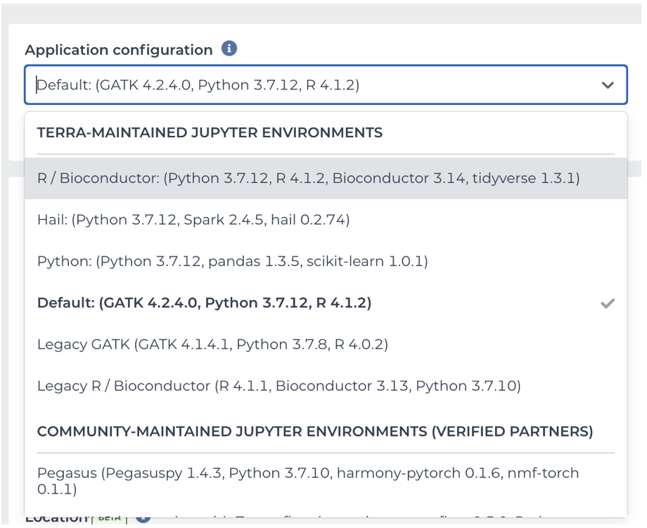
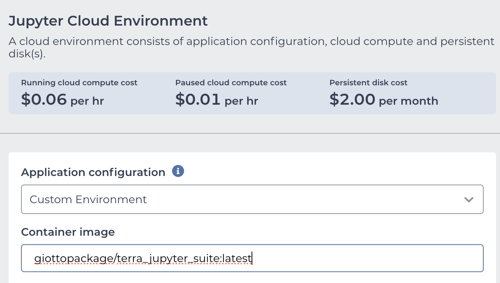
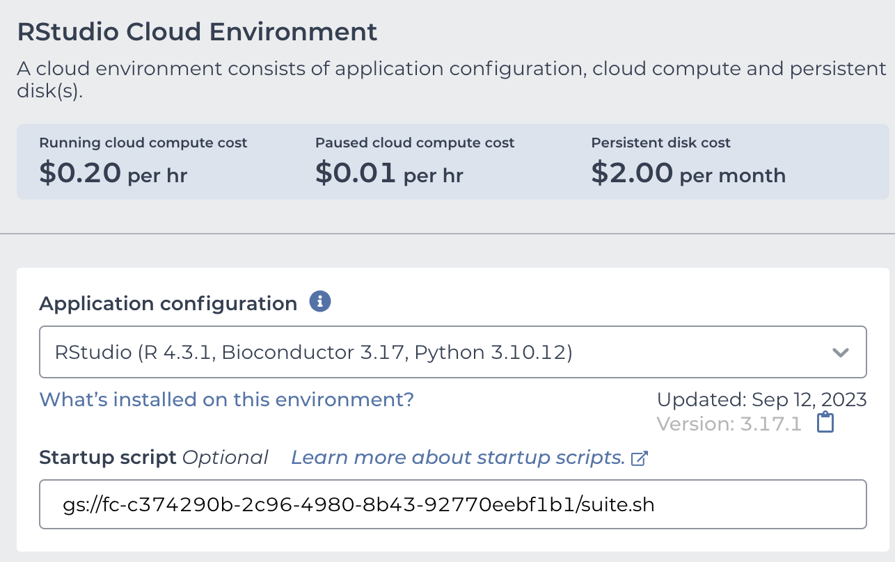
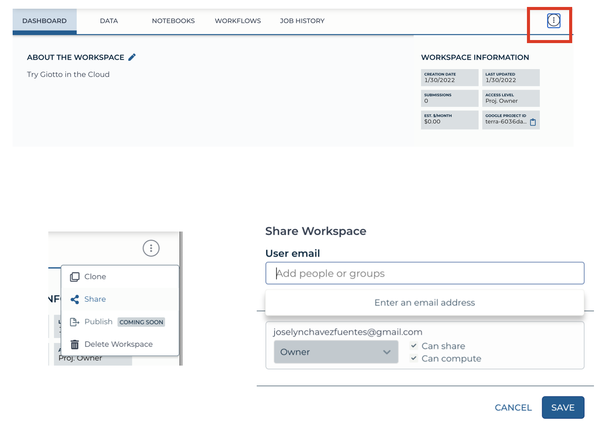

# Launching Giotto on the Cloud

You can run all your pipelines using Giotto on the Cloud through Terra.bio platform.

# 1. Setting up your Terra account

Go to [Terra](https://app.terra.bio/) on your Chrome browser and [Sign Up]{.title-ref} using the same email address that you will use for the billing account on Google Cloud Platform.

# 2. Creating a Billing Account

- Create an account on the Google Cloud Platform.
- Set Terra as a billing user on your account.
- Select your Google account to create your billing project on Terra.

For additional information about billing account go to this [link](https://support.terra.bio/hc/en-us/articles/360048632271-Understanding-Terra-costs-and-billing).

# 3. Create A Workspace

- Create a workspace within your billing account.


**Note** All users with access permissions to your workspace will share the same billing account.


- Launch a Virtual Machine with a Cloud environment.

# 4. Create a Cloud Environment

In Terra, you can run Cloud Environments using Jupyter notebooks or the RStudio App. We recommend to your either the Juypyter notebook + Python + Bioconductor or RStudio + Bioconductor options.



You can customize the memory usage, the number of CPUs, and the persistent disk size for your virtual machine.


Now you can install the Giotto package by running the R commmand:

```{r, eval=FALSE}
remotes::install_github('drieslab/Giotto')
```

# 5. Create a ready-to-use Cloud Environment with Giotto

You can pre-install the Giotto package while launching the Jupyter notebook or the RStudio App.

- To create a customized Jupyter notebook, use our Terra-based Docker image: **giottopackage/terra_jupyter_suite:latest**



- To create a customized RStudio session use the startup script url: **gs://fc-c374290b-2c96-4980-8b43-92770eebf1b1/suite.sh**



- Click on Create Environment

# 6. Share your workspace with collaborators

You can share your workspace with collaborators, including data, notebooks, and workflows stored in your workspace.

- Go to the Dashboard tab on your workspace and click the three dots on the upper right corner.
- Select Share option.
- Add the email of your collaborator. They will receive an invitation for joining the worskpace.
- You can select which permissions are granted to your collaborator (reader, writer or owner).
- Click the save button.



**Considerations**

- Keep in mind that all Cloud environments (virtual machines) launched within the same workspace are linked to the same billing account.
- Simultaneous modification of notebooks are not allowed.
- Opening the notebook while someone else is editing will show a message, but the current editor is not notified when someone else is trying to open the notebook.

