# 1 Dataset explanation

The [Human glioblastoma (FFPE) dataset](https://www.10xgenomics.com/resources/datasets/gene-and-protein-expression-library-of-human-glioblastoma-cytassist-ffpe-2-standard/) was obtained from 10x Genomics. The tissue was sectioned as described in Visium CytAssist Spatial Gene Expression for FFPE -- Tissue Preparation Guide Demonstrated Protocol (CG000518). 5 µm tissue sections were placed on Superfrost glass slides, then IF stained following deparaffinization, then hard coverslipped. Sections were imaged, decoverslipped, followed by Demonstrated Protocol (CG000494).

More information about this dataset can be found [here](https://www.10xgenomics.com/resources/datasets/gene-and-protein-expression-library-of-human-glioblastoma-cytassist-ffpe-2-standard).

# 2 Start Giotto

```{r, eval=FALSE}
# Ensure Giotto Suite is installed
if(!"Giotto" %in% installed.packages()) {
  pak::pkg_install("drieslab/Giotto")
}

# Ensure the Python environment for Giotto has been installed
genv_exists = Giotto::checkGiottoEnvironment()
if(!genv_exists){
  # The following command need only be run once to install the Giotto environment
  Giotto::installGiottoEnvironment()
}
```

```{r, eval=FALSE}
library(Giotto)

# 1. set results directory
results_directory = 'results'

# 2. set giotto python path
# set python path to your preferred python version path
# set python path to NULL if you want to automatically install (only the 1st time) and use the giotto miniconda environment
python_path = NULL
if(is.null(python_path)) {
  installGiottoEnvironment()
}

# 3. create giotto instructions
instrs = createGiottoInstructions(save_dir = results_directory,
                                  save_plot = TRUE,
                                  show_plot = TRUE,
                                  python_path = python_path)
```

# 3 Create Giotto object

The minimum requirements are

-   matrix with expression information (or path to)
-   x,y(,z) coordinates for cells or spots (or path to)

createGiottoVisiumObject() will automatically detect both rna and protein modalities within the expression matrix creating a multi-omics Giotto object.

```{r, eval=FALSE}
# Provide path to visium folder
data_directory <- 'path/to/visium/data'

# Create Giotto object
visium = createGiottoVisiumObject(visium_dir = data_directory,
                                  expr_data = 'raw',
                                  png_name = 'tissue_lowres_image.png',
                                  gene_column_index = 2,
                                  instructions = instrs)
```

How to work with Giotto instructions that are part of your Giotto object:

-   Show the instructions associated with your Giotto object with showGiottoInstructions()
-   Change one or more instructions with changeGiottoInstructions()
-   Replace all instructions at once with replaceGiottoInstructions()
-   Read or get a specific Giotto instruction with readGiottoInstructions()

```{r, eval=FALSE}
# show instructions associated with the giotto object

showGiottoInstructions(visium)
```

# 4 Processing

-   Filter features and cells based on detection frequencies
-   Normalize expression matrix (log transformation, scaling factor and/or z-scores)
-   Add cell and feature statistics (optional)
-   Adjust expression matrix for technical covariates or batches (optional).

```{r, eval=FALSE}
# Subset on spots that were covered by tissue
metadata = pDataDT(visium)
in_tissue_barcodes = metadata[in_tissue == 1]$cell_ID
visium = subsetGiotto(visium, cell_ids = in_tissue_barcodes)

## Visualize aligned tissue
spatPlot2D(gobject = visium,
           point_alpha = 0.7)
```

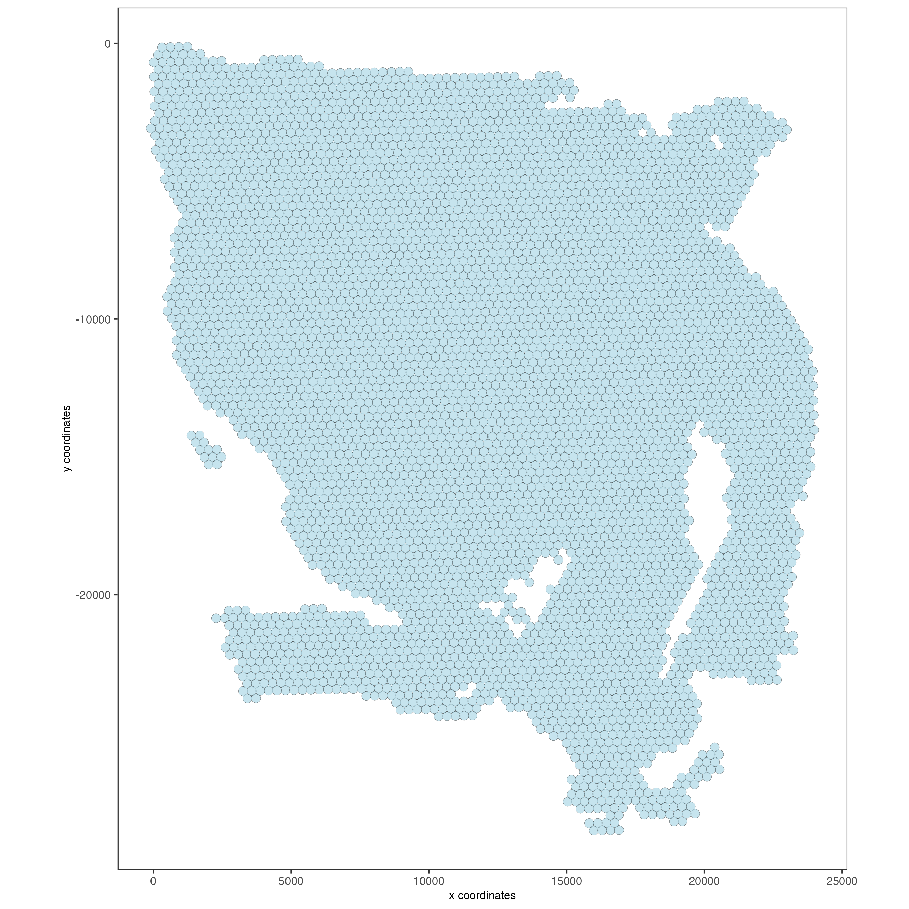

```{r, eval=FALSE}
# Filtering, normalization, and statistics

## RNA feature
visium <- filterGiotto(gobject = visium,
                       expression_threshold = 1,
                       feat_det_in_min_cells = 50,
                       min_det_feats_per_cell = 1000,
                       expression_values = c('raw'),
                       verbose = TRUE)

visium <- normalizeGiotto(gobject = visium,
                          scalefactor = 6000,
                          verbose = TRUE)

visium <- addStatistics(gobject = visium)

### Visualize number of features after processing
spatPlot2D(gobject = visium,
           point_alpha = 0.7,
           cell_color = 'nr_feats',
           color_as_factor = FALSE)
```

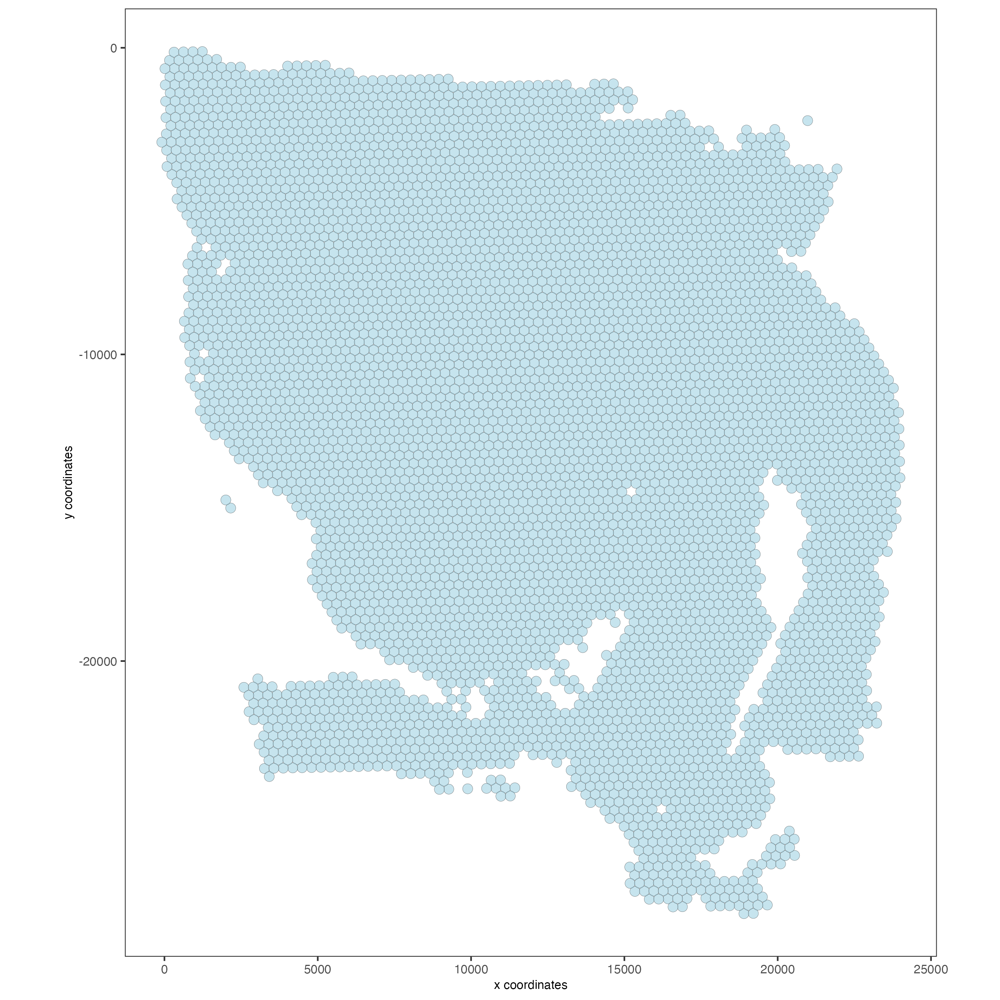

```{r, eval=FALSE}
## Protein feature 
visium <- filterGiotto(gobject = visium, 
                       spat_unit = 'cell',
                       feat_type = 'protein',
                       expression_threshold = 1,
                       feat_det_in_min_cells = 50, 
                       min_det_feats_per_cell = 1,
                       expression_values = 'raw', 
                       verbose = TRUE)

visium <- normalizeGiotto(gobject = visium,
                          spat_unit = 'cell', 
                          feat_type = 'protein', 
                          scalefactor = 6000, 
                          verbose = TRUE)

visium <- addStatistics(gobject = visium,
                        spat_unit = 'cell', 
                        feat_type = 'protein')

### Visualize number of features after processing 
spatPlot2D(gobject = visium,
           spat_unit = 'cell', 
           feat_type = 'protein', 
           point_alpha = 0.7, 
           cell_color = 'nr_feats', 
           color_as_factor = FALSE)
```

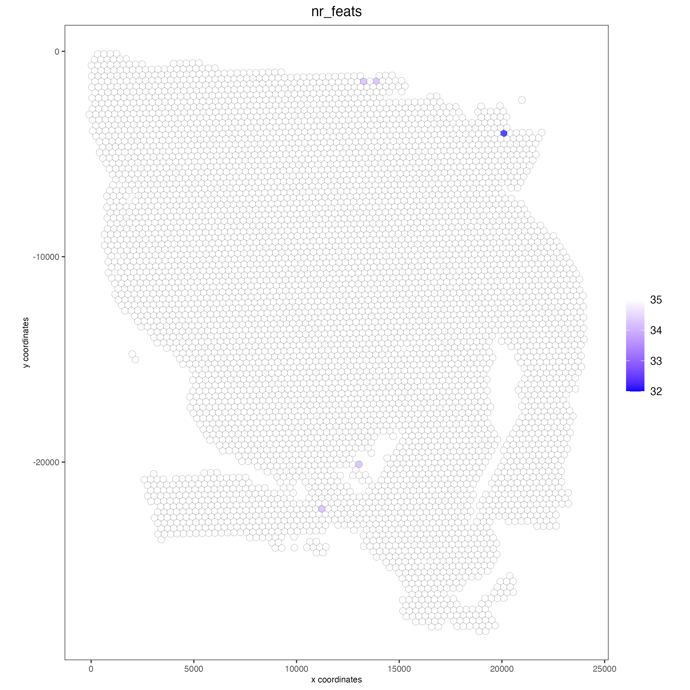

# 5 Dimention Reduction

```{r, eval=FALSE}
# Identify highly variable features (HVF)
visium <- calculateHVF(gobject = visium)
```

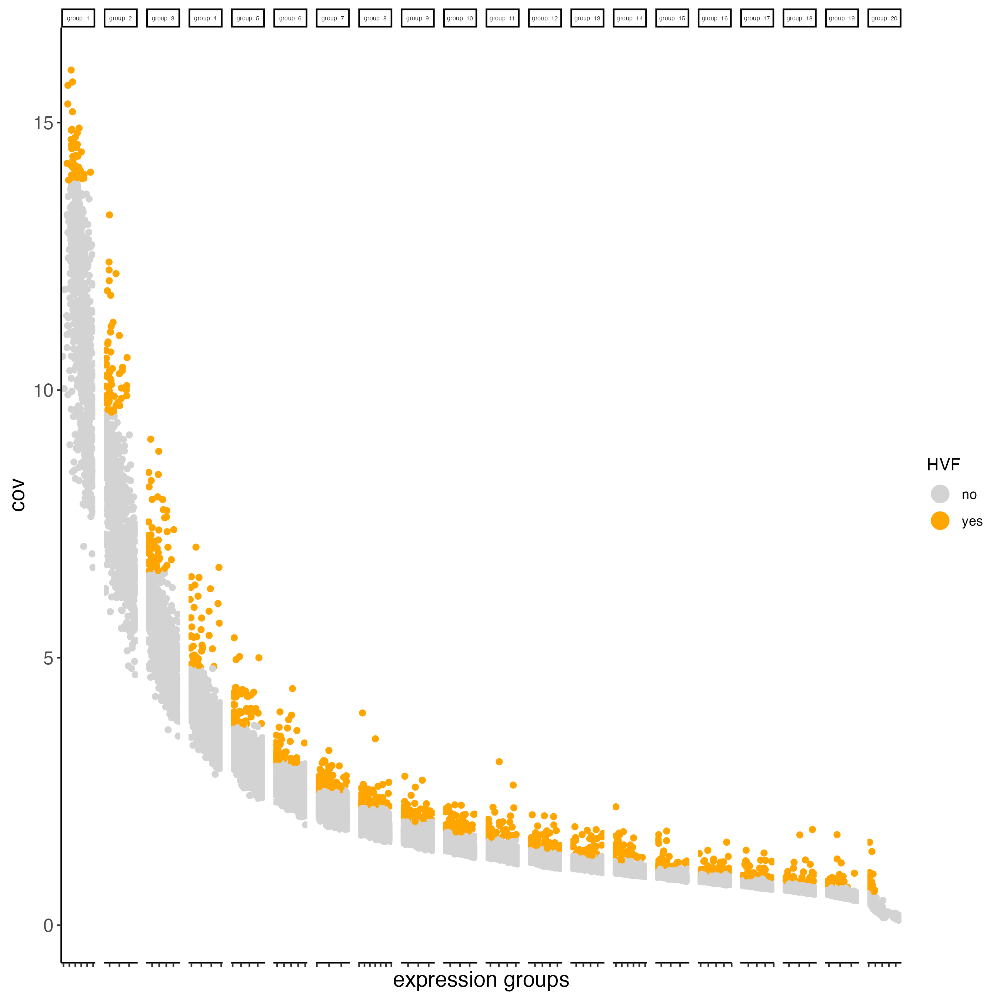

```{r, eval=FALSE}
# PCA

## RNA
visium <- runPCA(gobject = visium)

screePlot(visium, ncp = 30)
```


```{r, eval=FALSE}
### Visualize RNA PCA
plotPCA(gobject = visium)
```


```{r, eval=FALSE}
## Protein
visium <- runPCA(gobject = visium,
                 spat_unit = 'cell',
                 feat_type = 'protein')

screePlot(visium,
          spat_unit = 'cell',
          feat_type = 'protein',
          ncp = 30)
```


```{r, eval=FALSE}
### Visualize Protein PCA
plotPCA(gobject = visium,
        spat_unit = 'cell',
        feat_type = 'protein')
```

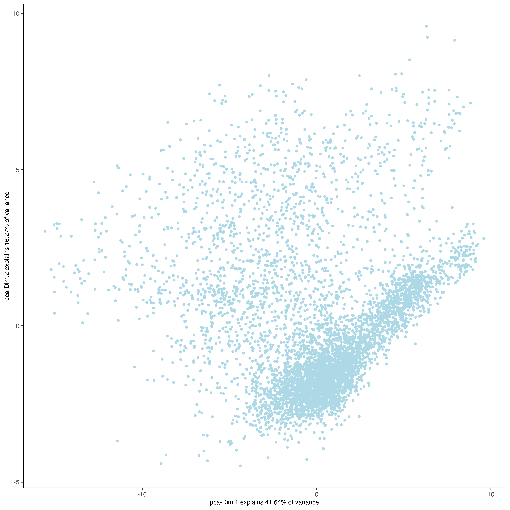

# 6 Clustering

```{r, eval=FALSE}
# cluster and run UMAP
# sNN network (default)

## RNA feature
visium <- createNearestNetwork(gobject = visium,
                               dimensions_to_use = 1:10,
                               k = 30)

## Protein feature
visium <- createNearestNetwork(gobject = visium,
                               spat_unit = 'cell',
                               feat_type = 'protein',
                               dimensions_to_use = 1:10,
                               k = 30)

# Leiden clustering

## RNA feature
visium <- doLeidenCluster(gobject = visium,
                          resolution = 1,
                          n_iterations = 1000)

## Protein feature
visium <- doLeidenCluster(gobject = visium,
                          spat_unit = 'cell',
                          feat_type = 'protein',
                          resolution = 1,
                          n_iterations = 1000)

# UMAP

## RNA feature
visium <- runUMAP(visium,
                  dimensions_to_use = 1:10)

plotUMAP(gobject = visium,
         cell_color = 'leiden_clus',
         show_NN_network = TRUE,
         point_size = 2)
```

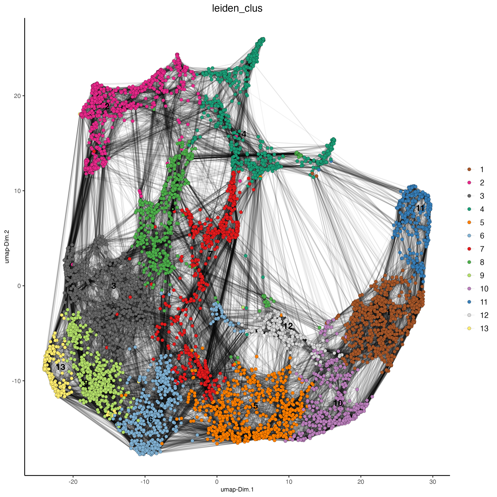

```{r, eval=FALSE}
## Protein feature 
visium <- runUMAP(visium,
                  spat_unit = 'cell', 
                  feat_type = 'protein', 
                  dimensions_to_use = 1:10)

plotUMAP(gobject = visium,
         spat_unit = 'cell', 
         feat_type = 'protein', 
         cell_color = 'leiden_clus', 
         show_NN_network = TRUE, 
         point_size = 2)
```

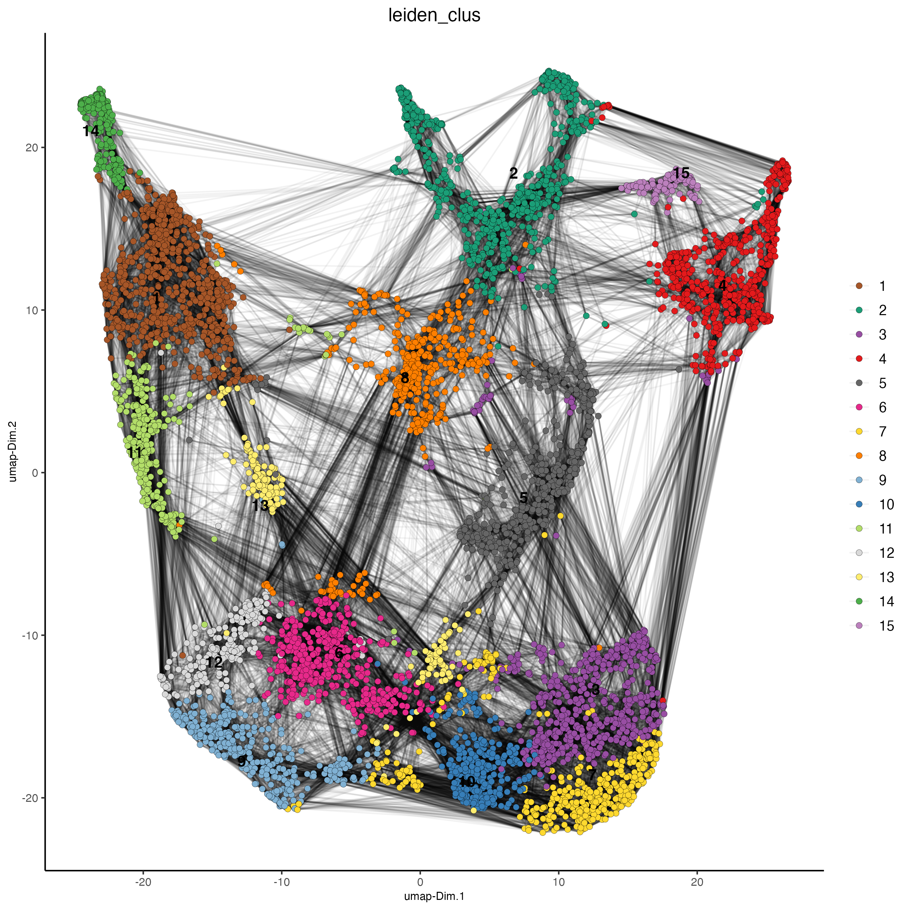

```{r, eval=FALSE}
# Visualize spatial plot

## RNA feature
spatPlot2D(gobject = visium,
           show_image = TRUE,
           cell_color = 'leiden_clus',
           point_size = 2)
```

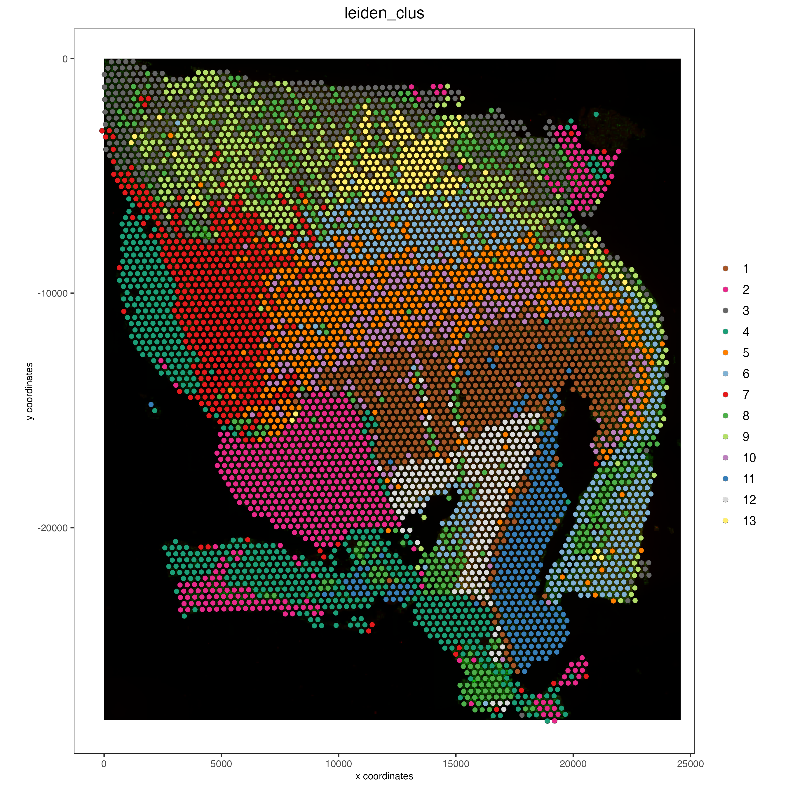

```{r, eval=FALSE}
## Protein feature
spatPlot2D(gobject = visium,
           spat_unit = 'cell',
           feat_type = 'protein',
           show_image = TRUE,
           cell_color = 'leiden_clus',
           point_size = 2)
```

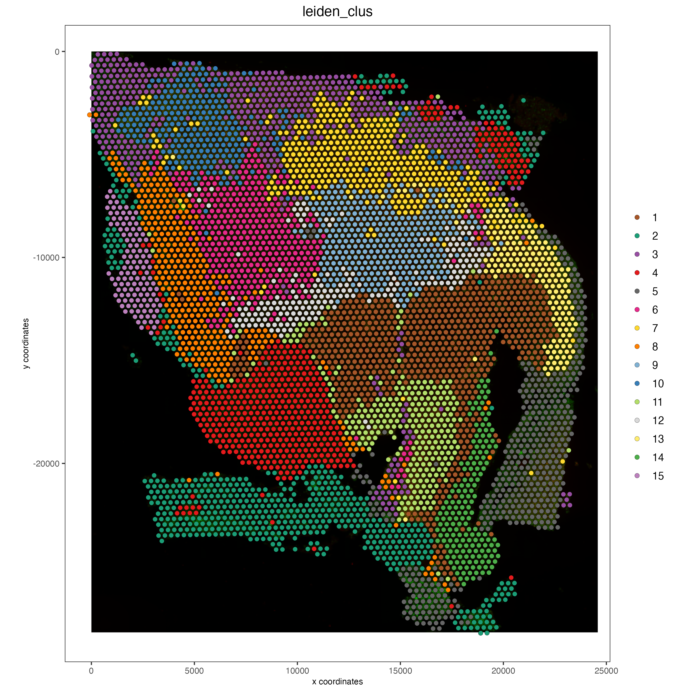

# 7 Multi-omics integration

The Weighted Nearest Neighbors allows to integrate two or more modalities acquired from the same sample. WNN will re-calculate the clustering to provide an integrated umap and leiden clustering. For running WNN, the Giotto object must contain the results of running PCA calculation for each modality.

```{r, eval=FALSE}
# Calculate kNN

## RNA modality
visium <- createNearestNetwork(gobject = visium,
                               type = 'kNN',
                               dimensions_to_use = 1:10,
                               k = 20)

## Protein modality
visium <- createNearestNetwork(gobject = visium,
                               spat_unit = 'cell',
                               feat_type = 'protein',
                               type = 'kNN',
                               dimensions_to_use = 1:10,
                               k = 20)


# Run WNN
visium <- runWNN(visium,
                 spat_unit = "cell",
                 modality_1 = "rna",
                 modality_2 = "protein",
                 pca_name_modality_1 = "pca",
                 pca_name_modality_2 = "protein.pca",
                 k = 20,
                 integrated_feat_type = NULL,
                 matrix_result_name = NULL,
                 w_name_modality_1 = NULL,
                 w_name_modality_2 = NULL,
                 verbose = TRUE)

# Run Integrated umap
visium <- runIntegratedUMAP(visium,
                            modality1 = "rna",
                            modality2 = "protein",
                            spread = 5,
                            min_dist = 0.5,
                            force = FALSE)

# Calculate integrated clusters
visium <- doLeidenCluster(gobject = visium,
                          spat_unit = "cell",
                          feat_type = "rna",
                          nn_network_to_use = "kNN",
                          network_name = "integrated_kNN",
                          name = "integrated_leiden_clus",
                          resolution = 1)

# Visualize integrated umap
plotUMAP(gobject = visium,
         spat_unit = "cell",
         feat_type = "rna",
         cell_color = 'integrated_leiden_clus',
         dim_reduction_name = "integrated.umap",
         point_size = 1.5,
         title = "Integrated UMAP using Integrated Leiden clusters",
         axis_title = 12,
         axis_text = 10 )
```

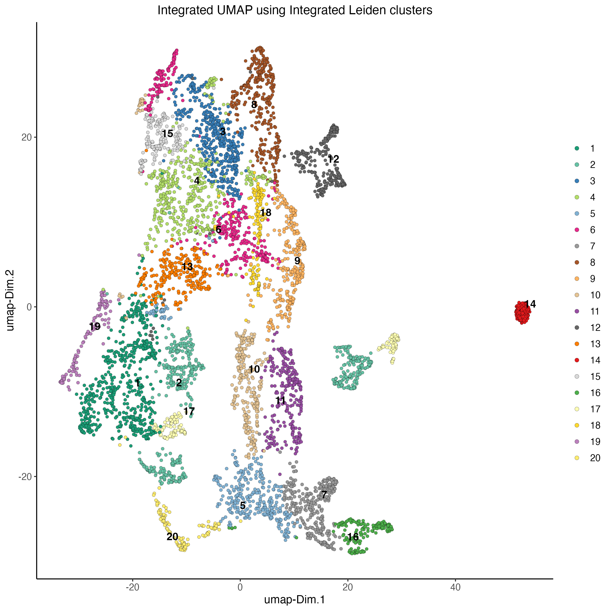

```{r, eval=FALSE}
# Visualize spatial plot with integrated clusters
spatPlot2D(visium,
           spat_unit = "cell",
           feat_type = "rna",
           cell_color = "integrated_leiden_clus",
           point_size = 2,
           show_image = FALSE,
           title = "Integrated Leiden clustering")
```

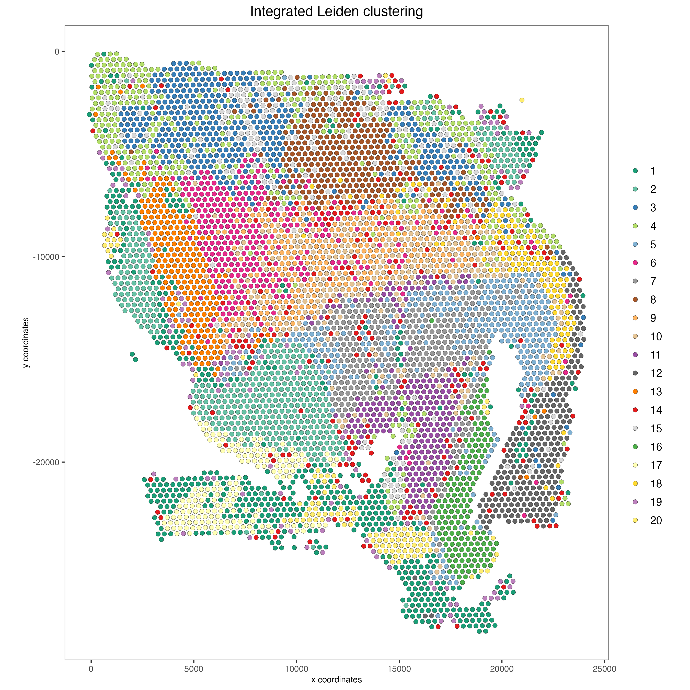

# 8 Session Info

```{r, eval=FALSE}
sessionInfo()

R version 4.3.2 (2023-10-31)
Platform: aarch64-apple-darwin20 (64-bit)
Running under: macOS Sonoma 14.1.2

Matrix products: default
BLAS:   /System/Library/Frameworks/Accelerate.framework/Versions/A/Frameworks/vecLib.framework/Versions/A/libBLAS.dylib 
LAPACK: /Library/Frameworks/R.framework/Versions/4.3-arm64/Resources/lib/libRlapack.dylib;  LAPACK version 3.11.0

locale:
[1] en_US.UTF-8/en_US.UTF-8/en_US.UTF-8/C/en_US.UTF-8/en_US.UTF-8

time zone: America/New_York
tzcode source: internal

attached base packages:
[1] stats     graphics  grDevices utils     datasets  methods   base     

loaded via a namespace (and not attached):
 [1] vctrs_0.6.5       cli_3.6.2         knitr_1.45        rlang_1.1.3       xfun_0.41         stringi_1.8.3    
 [7] purrr_1.0.2       pkgload_1.3.4     promises_1.2.1    shiny_1.8.0       xtable_1.8-4      glue_1.7.0       
[13] htmltools_0.5.7   httpuv_1.6.13     pkgbuild_1.4.3    rmarkdown_2.25    evaluate_0.23     ellipsis_0.3.2   
[19] fastmap_1.1.1     yaml_2.3.8        lifecycle_1.0.4   memoise_2.0.1     stringr_1.5.1     compiler_4.3.2   
[25] miniUI_0.1.1.1    sessioninfo_1.2.2 fs_1.6.3          htmlwidgets_1.6.4 Rcpp_1.0.12       urlchecker_1.0.1 
[31] rstudioapi_0.15.0 later_1.3.2       digest_0.6.34     R6_2.5.1          usethis_2.2.2     magrittr_2.0.3   
[37] tools_4.3.2       mime_0.12         devtools_2.4.5    profvis_0.3.8     remotes_2.4.2.1   cachem_1.0.8    
