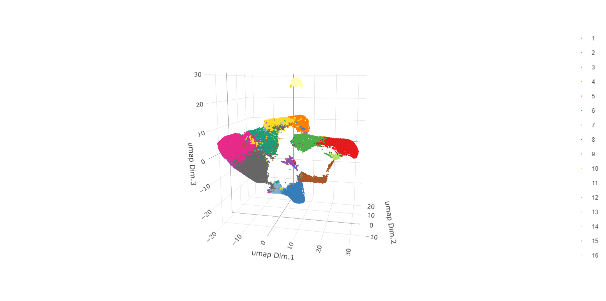
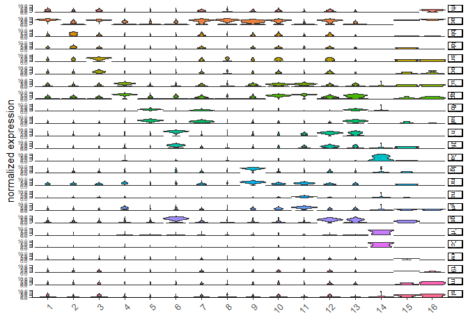
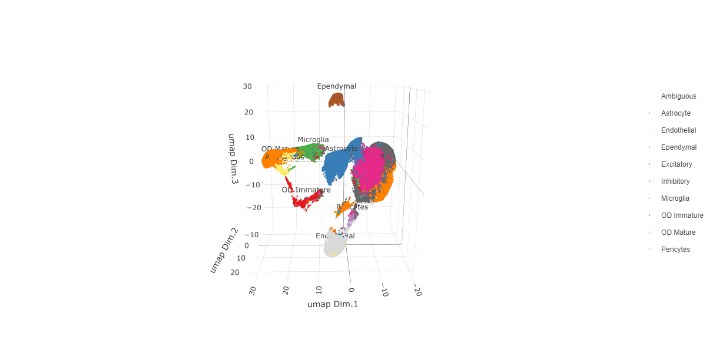
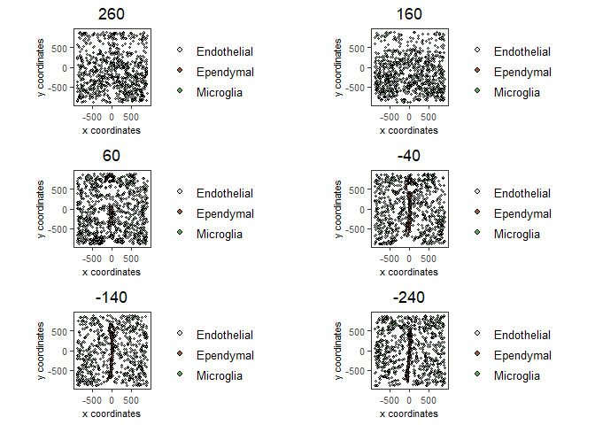

# 1. Dataset explanation

This tutorial walks through the visualization capabilities of Giotto. The clustering and dimension reduction methods focused on within the [dimension reduction](./dimension_reduction.html) tutorial will be revisited and utilized to create heatmaps, violin plots, and visualizations that are unique to Giotto: spatial maps and networks.

This tutorial uses a merFISH dataset of mouse hypothalamic preoptic regions from [Moffitt et al.](https://doi.org/10.1126/science.aau5324). A complete walkthrough of that dataset can be found [here](./merFISH_hypoth_220915.html). To download the data used to create the Giotto Object below, please ensure that
[wget](https://www.gnu.org/software/wget/?) is installed locally.

# 2. Start Giotto


```{r, eval=FALSE}
# Ensure Giotto Suite is installed
if(!"Giotto" %in% installed.packages()) {
  devtools::install_github("drieslab/Giotto@suite")
}

library(Giotto)

# Ensure Giotto Data is installed
if(!"GiottoData" %in% installed.packages()) {
  devtools::install_github("drieslab/GiottoData")
}

library(GiottoData)

# Ensure the Python environment for Giotto has been installed
genv_exists = checkGiottoEnvironment()
if(!genv_exists){
  # The following command need only be run once to install the Giotto environment
  installGiottoEnvironment()
}
```


# 3. Create a Giotto object


```{r, eval=FALSE}
# Specify path from which data may be retrieved/stored
data_directory = paste0(getwd(),'/gobject_visual_data/')
# alternatively, "/path/to/where/the/data/lives/"

# Specify path to which results may be saved
results_directory = paste0(getwd(),'/gobject_visual_results/') 
# alternatively, "/path/to/store/the/results/"

# Optional: Specify a path to a Python executable within a conda or miniconda 
# environment. If set to NULL (default), the Python executable within the previously
# installed Giotto environment will be used.
my_python_path = NULL # alternatively, "/local/python/path/python" if desired.

# Get the dataset
getSpatialDataset(dataset = 'merfish_preoptic', 
                  directory = data_directory, 
                  method = 'wget')
```

```{r, eval=FALSE}
### Giotto instructions and data preparation
# Optional: Set Giotto instructions
instrs = createGiottoInstructions(save_plot = TRUE, 
                                  show_plot = TRUE,
                                  save_dir = results_directory, 
                                  python_path = my_python_path)
```

```{r, eval=FALSE}
# Create file paths to feed data into Giotto object 
expr_path = paste0(data_directory, "merFISH_3D_data_expression.txt.gz")
loc_path = paste0(data_directory, "merFISH_3D_data_cell_locations.txt")
meta_path = paste0(data_directory, "merFISH_3D_metadata.txt")

### Create Giotto object
testobj <- createGiottoObject(expression = expr_path,
                              spatial_locs = loc_path,
                              instructions = instrs)
```

```{r, eval=FALSE}
# Add additional metadata
metadata = data.table::fread(meta_path)

testobj = addCellMetadata(testobj, 
                          new_metadata = metadata$layer_ID, 
                          vector_name = 'layer_ID')

testobj = addCellMetadata(testobj, 
                          new_metadata = metadata$orig_cell_types, 
                          vector_name = 'orig_cell_types')

### Process the Giotto Object
# Note that for the purposes of this tutorial, the entire dataset will be visualized. 
# Thus, filter parameters are set to 0, so as to not remove any cells.
# Note that since adjustment is not required, adjust_params is set to NULL.

testobj <- processGiotto(testobj,
                         filter_params = list(expression_threshold = 0,
                                              feat_det_in_min_cells = 0, 
                                              min_det_feats_per_cell = 0),
                         norm_params = list(norm_methods = 'standard', 
                                            scale_feats = TRUE, 
                                            scalefactor = 1000),
                         stat_params = list(expression_values = 'normalized'),
                         adjust_params = NULL)
```


# 4. Visualize the Dataset

This dataset includes eight sequential slices. As such it can be visualized both in 2D and 3D.

In 2D:


```{r, eval=FALSE}
spatPlot(gobject = testobj, point_size = 1.5)
```


In 3D:


```{r, eval=FALSE}
spatPlot3D(gobject = testobj, point_size = 1, axis_scale = 'real')
```


# 5. Create and Visualize Clusters

First, run a PCA on the data. For the purposes of this tutorial, no highly variable genes will be identified or used in the reduction for simplicity. The data will simply undergo a dimension reduction through PCA. Then, run a UMAP on the data for pre-clustering visualization. The UMAP may also be plotted in 2D and 3D.


```{r, eval=FALSE}
# Run PCA
testobj <- runPCA(gobject = testobj, feats_to_use = NULL, scale_unit = FALSE, center = TRUE)
```

```{r, eval=FALSE}
# Run UMAP
testobj <- runUMAP(gobject = testobj, dimensions_to_use = 1:8, n_components = 3, n_threads = 4)
# Plot UMAP in 2D
plotUMAP_2D(gobject = testobj, point_size = 1.5) 
```


```{r, eval=FALSE}
# Plot UMAP 3D
plotUMAP_3D(gobject = testobj, point_size = 1.5) 
```

 


Now, the data may be clustered. Create a nearest network, and then create Leiden clusters. The clusters may be visualized in 2D or 3D, as well as upon the UMAP and within the tissue.


```{r, eval=FALSE}
# Create a k Nearest Network for clustering
testobj <- createNearestNetwork(gobject = testobj, dimensions_to_use = 1:8, k = 10)
```

```{r, eval=FALSE}
# Preform Leiden clustering
testobj <- doLeidenCluster(gobject = testobj, 
                           resolution = 0.25, 
                           n_iterations = 200, 
                           name = 'leiden_0.25.200')

# Plot the clusters upon the UMAP
plotUMAP_3D(gobject = testobj, cell_color = 'leiden_0.25.200', point_size = 1.5,
            show_center_label = F, save_param = list(save_name = 'leiden_0.25.200_UMAP_3D'))
```




Visualize Leiden clusters within the tissue by creating a Spatial Plot, grouping by layer_ID.


```{r, eval=FALSE}
spatPlot2D(gobject = testobj, 
           point_size = 1.0, 
           cell_color = 'leiden_0.25.200', 
           group_by = 'layer_ID', 
           cow_n_col = 2, 
           group_by_subset = c(260, 160, 60, -40, -140, -240))
```

 


Visualize expression levels within the tissue by creating a Spatial Plot, grouping by layer_ID, and specifying *cell_color* as the number of features detected per cell.


```{r, eval=FALSE}
# Plot cell_color as a representation of the number of features/ cell ("nr_feats")
spatPlot2D(gobject = testobj, point_size = 1.5, 
           cell_color = 'nr_feats', color_as_factor = F,
           group_by = 'layer_ID', cow_n_col = 2, group_by_subset = c(260, 160, 60, -40, -140, -240))
```

 


# 6. Compare Clusters

We can compare clusters using a heatmap:


```{r, eval=FALSE}
showClusterHeatmap(gobject = testobj, cluster_column = 'leiden_0.25.200', save_plot = T)
```

 


We can plot a dendogram to explore cluster similarity:


```{r, eval=FALSE}
showClusterDendrogram(testobj, h = 0.5, rotate = T, cluster_column = 'leiden_0.25.200')
```

 


# 7 Visualize Cell Markers

Marker features may be identified by calling **findMarkers_one_vs_all**. This function detects differentially expressed features by comparing a single cluster to all others. Currently, three methods are supported: "*scran*", "*gini*", and "*mast*". Here, the "*gini*" method is employed; details on the gini method may be found [here](../docs/reference/findGiniMarkers.html).


```{r, eval=FALSE}
markers = findMarkers_one_vs_all(gobject = testobj,
                                 method = 'gini',
                                 expression_values = 'normalized',
                                 cluster_column = 'leiden_0.25.200',
                                 min_feats = 1, rank_score = 2)
```

```{r, eval=FALSE}
topgini_genes = unique(markers[, head(.SD, 2), by = 'cluster']$feats)
```


Create a violinplot:


```{r, eval=FALSE}
violinPlot(testobj, feats = topgini_genes, cluster_column = 'leiden_0.25.200', strip_position = 'right')
```

 



Create a heatmap of top gini genes by cluster:


```{r, eval=FALSE}
plotMetaDataHeatmap(testobj, expression_values = 'scaled',
                    metadata_cols = c('leiden_0.25.200'),
                    selected_feats = topgini_genes)
```

 


# 8. Visualize Cell Types in Tissue

To do this, the Leiden clusters must be annotated. Leveraging the provided cell metadata and Giotto Spatial Plots, Leiden clusters may be manually assigned a cell type. Alternative approaches (i.e. in the absence of cell metadata with cell type identification ) could involve the analysis of each cluster for enrichment in cell-specific marker genes.

Since cell type annotations are included within the metadata that was loaded into the Giotto Object, the UMAP may be plotted with cell-type annotations. If cell types are known, Leiden clusters may be manually assigned to a cell type, as will be done here.


```{r, eval=FALSE}
# Plot the UMAP, annotated by cell type. 
plotUMAP_3D(testobj, 
            cell_color = 'orig_cell_types', 
            save_param = list(save_name = 'Original_Cell_Types_UMAP_3D'))
```

 


Manually assign cell types to clusters via inspection of UMAP plots. Specifically, the UMAP plots saved as *"leiden_0.25.200_UMAP3D"* and *"Original_Cell_Types_UMAP3D"* are being compared for assignment.


```{r, eval=FALSE}
# Manually assign Leiden clusters to a cell type
cluster_range = unique(testobj@cell_metadata$cell$rna$leiden_0.25.200)

# Note that cell types were condensed (i.e. "Endothelial 1", "Endothelial 2", ... were
# combined into one cell type "Endothelial")
manual_cluster = c('Inhibitory', 'Excitatory', 'Inhibitory', 'Astrocyte', 'OD Mature', 
                   'Endothelial', 'Microglia', 'OD Mature', 'OD Immature', 'Astrocyte',
                   'Ependymal', 'Pericytes', 'Ambiguous', 'Microglia', 'Inhibitory', 'Inhibitory')

names(manual_cluster) = as.character(sort(cluster_range))

testobj = annotateGiotto(gobject = testobj, 
                         annotation_vector = manual_cluster,
                         cluster_column = 'leiden_0.25.200', 
                         name = 'cell_types')

cell_types_in_plot = c('Inhibitory', 'Excitatory','OD Mature', 'OD Immature', 
                       'Astrocyte', 'Microglia', 'Ependymal','Endothelial',
                       'Pericytes', 'Ambiguous')

# This Giotto function will provide a distinct color palette. Colors 
# may change each time the function is run. 
mycolorcode = getDistinctColors(length(cell_types_in_plot))

names(mycolorcode) = cell_types_in_plot

# Visualize the assigned types in the UMAP
plotUMAP_3D(testobj, cell_color = 'cell_types', point_size = 1.5, 
            cell_color_code = mycolorcode,
            save_param = list(save_name = 'manual_cluster_typing_UMAP_3D'))
```

 



Now that each Leiden cluster has an associated cell type, cell types may be viewed in tissue in 2D and in 3D within a Spatial Plot by specifying the *cell_color* parameter as the name of the annotation, 'cell_types'.


```{r, eval=FALSE}
spatPlot2D(gobject = testobj, point_size = 1.0,
          cell_color = 'cell_types', group_by = 'layer_ID', 
          cell_color_code = mycolorcode, cow_n_col = 2, 
          group_by_subset = c(seq(260, -290, -100)))
```

 


```{r, eval=FALSE}
spatPlot3D(testobj,
           cell_color = 'cell_types', axis_scale = 'real',
           sdimx = 'sdimx', sdimy = 'sdimy', sdimz = 'sdimz',
           show_grid = F, cell_color_code = mycolorcode)
```

 


The plots may be subset by cell type in 2D and 3D.


```{r, eval=FALSE}
spatPlot2D(gobject = testobj, point_size = 1.0, 
           cell_color = 'cell_types', cell_color_code = mycolorcode,
           select_cell_groups = c('Microglia', 'Ependymal', 'Endothelial'), show_other_cells = F,
           group_by = 'layer_ID', cow_n_col = 2, group_by_subset = c(seq(260, -290, -100)))
```

 



```{r, eval=FALSE}
spatPlot3D(testobj,
           cell_color = 'cell_types', axis_scale = 'real',
           sdimx = 'sdimx', sdimy = 'sdimy', sdimz = 'sdimz',
           show_grid = F, cell_color_code = mycolorcode,
           select_cell_groups = c('Microglia', 'Ependymal', 'Endothelial'), show_other_cells = F)
```

 


# 9. Visualize Cell Networks

It is preferred to use Delaunay geometry to create spatial networks. In other cases, k-nearest neighbor may be used to create a spatial network. Specifying the *method* parameter within [createSpatialNetwork](../docs/reference/createSpatialNetwork.html) will accomplish this. By default, this function runs the Delaunay method. Here, both methods, as well as potential modifications to the k-nearest networks, will be shown.


```{r, eval=FALSE}
### Spatial Networks
# The following function provides insight to the Delaunay Network. It will be shown in-console
# if this command is run as written.
plotStatDelaunayNetwork(gobject= testobj, 
                        method = 'delaunayn_geometry', 
                        maximum_distance = 50, 
                        show_plot = T, 
                        save_plot = F)
```

 


```{r, eval=FALSE}
# Create Spatial Network using Delaunay geometry
testobj = createSpatialNetwork(gobject = testobj, 
                               delaunay_method = 'delaunayn_geometry', 
                               minimum_k = 2, 
                               maximum_distance_delaunay = 50)

# Create Spatial Networks using k-nearest neighbor with varying specifications
testobj <- createSpatialNetwork(gobject = testobj, 
                                method = 'kNN', 
                                k = 5, 
                                name = 'spatial_network')

testobj <- createSpatialNetwork(gobject = testobj, 
                                method = 'kNN', 
                                k = 10, 
                                name = 'large_network')

testobj <- createSpatialNetwork(gobject = testobj, 
                                method = 'kNN', 
                                k = 100, 
                                maximum_distance_knn = 200, 
                                minimum_k = 2, 
                                name = 'distance_network')

# Now, visualize the different spatial networks in one layer of the dataset
# Here layer 260 is selected, and only high expressing cells are included
cell_metadata = getCellMetadata(testobj)[]
highexp_ids = cell_metadata[layer_ID==260][total_expr>=100]$cell_ID
subtestobj = subsetGiotto(testobj, cell_ids = highexp_ids)
```

```{r, eval=FALSE}
# Re-annotate the subset Giotto Object
subtestobj = annotateGiotto(gobject = subtestobj, 
                            annotation_vector = manual_cluster,
                            cluster_column = 'leiden_0.25.200', 
                            name = 'cell_types')
```

```{r, eval=FALSE}
spatPlot(gobject = subtestobj, show_network = T,
         network_color = 'blue', spatial_network_name = 'Delaunay_network',
         point_size = 1.5, cell_color = 'cell_types',
         save_param = list(save_name = 'Delaunay_network_spatPlot'))
```

 


```{r, eval=FALSE}
spatPlot(gobject = subtestobj, show_network = T,
         network_color = 'blue', spatial_network_name = 'spatial_network',
         point_size = 2.5, cell_color = 'cell_types',
         save_param = list(save_name = 'spatial_network_spatPlot'))
```

 


```{r, eval=FALSE}
spatPlot(gobject = subtestobj, show_network = T,
         network_color = 'blue', spatial_network_name = 'large_network',
         point_size = 2.5, cell_color = 'cell_types',
         save_param = list(save_name = 'large_network_spatPlot'))
```

 


```{r, eval=FALSE}
spatPlot(gobject = subtestobj, show_network = T,
         network_color = 'blue', spatial_network_name = 'distance_network',
         point_size = 2.5, cell_color = 'cell_types',
         save_param = list(save_name = 'distance_network_spatPlot'))
```

 


# 10. Session Info


```{r, eval=FALSE}
sessionInfo()
```

```{r, eval=FALSE}
    R version 4.2.2 (2022-10-31 ucrt)
    Platform: x86_64-w64-mingw32/x64 (64-bit)
    Running under: Windows 10 x64 (build 22621)

    Matrix products: default

    locale:
    [1] LC_COLLATE=English_United States.utf8 
    [2] LC_CTYPE=English_United States.utf8   
    [3] LC_MONETARY=English_United States.utf8
    [4] LC_NUMERIC=C                          
    [5] LC_TIME=English_United States.utf8    

    attached base packages:
    [1] stats     graphics  grDevices utils     datasets  methods   base     

    other attached packages:
    [1] GiottoData_0.2.1 Giotto_3.2.1    

    loaded via a namespace (and not attached):
      [1] matrixStats_0.63.0    RcppAnnoy_0.0.20      doParallel_1.0.17    
      [4] RColorBrewer_1.1-3    httr_1.4.5            rprojroot_2.0.3      
      [7] tools_4.2.2           utf8_1.2.3            R6_2.5.1             
     [10] irlba_2.3.5.1         uwot_0.1.14           lazyeval_0.2.2       
     [13] BiocGenerics_0.44.0   colorspace_2.1-0      GetoptLong_1.0.5     
     [16] withr_2.5.0           tidyselect_1.2.0      compiler_4.2.2       
     [19] progressr_0.13.0      textshaping_0.3.6     cli_3.4.1            
     [22] ggdendro_0.1.23       DelayedArray_0.24.0   plotly_4.10.1        
     [25] labeling_0.4.2        scales_1.2.1          rappdirs_0.3.3       
     [28] systemfonts_1.0.4     digest_0.6.30         dbscan_1.1-11        
     [31] rmarkdown_2.21        R.utils_2.12.2        pkgconfig_2.0.3      
     [34] htmltools_0.5.4       MatrixGenerics_1.10.0 fastmap_1.1.0        
     [37] htmlwidgets_1.6.2     rlang_1.1.0           GlobalOptions_0.1.2  
     [40] rstudioapi_0.14       shape_1.4.6           farver_2.1.1         
     [43] generics_0.1.3        jsonlite_1.8.3        crosstalk_1.2.0      
     [46] BiocParallel_1.32.6   dplyr_1.1.1           R.oo_1.25.0          
     [49] magrittr_2.0.3        BiocSingular_1.14.0   Matrix_1.5-1         
     [52] Rcpp_1.0.10           munsell_0.5.0         S4Vectors_0.36.2     
     [55] fansi_1.0.4           abind_1.4-5           reticulate_1.26      
     [58] lifecycle_1.0.3       R.methodsS3_1.8.2     terra_1.7-18         
     [61] yaml_2.3.7            MASS_7.3-58.1         grid_4.2.2           
     [64] parallel_4.2.2        crayon_1.5.2          lattice_0.20-45      
     [67] cowplot_1.1.1         beachmat_2.14.0       circlize_0.4.15      
     [70] magick_2.7.4          knitr_1.42            ComplexHeatmap_2.14.0
     [73] pillar_1.9.0          igraph_1.4.1          rjson_0.2.21         
     [76] codetools_0.2-18      ScaledMatrix_1.6.0    stats4_4.2.2         
     [79] magic_1.6-1           glue_1.6.2            evaluate_0.20        
     [82] data.table_1.14.6     png_0.1-7             vctrs_0.6.1          
     [85] foreach_1.5.2         gtable_0.3.3          purrr_1.0.1          
     [88] tidyr_1.3.0           clue_0.3-63           ggplot2_3.4.1        
     [91] xfun_0.38             rsvd_1.0.5            ragg_1.2.4           
     [94] viridisLite_0.4.1     geometry_0.4.7        tibble_3.2.1         
     [97] iterators_1.0.14      IRanges_2.32.0        cluster_2.1.4        
    [100] ellipsis_0.3.2        here_1.0.1           

```
