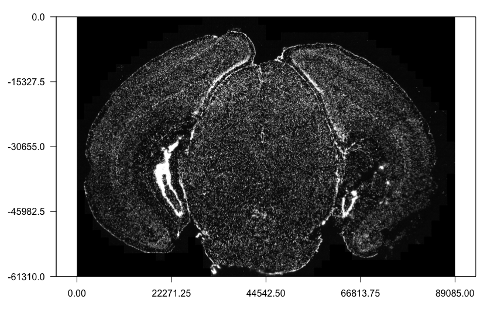
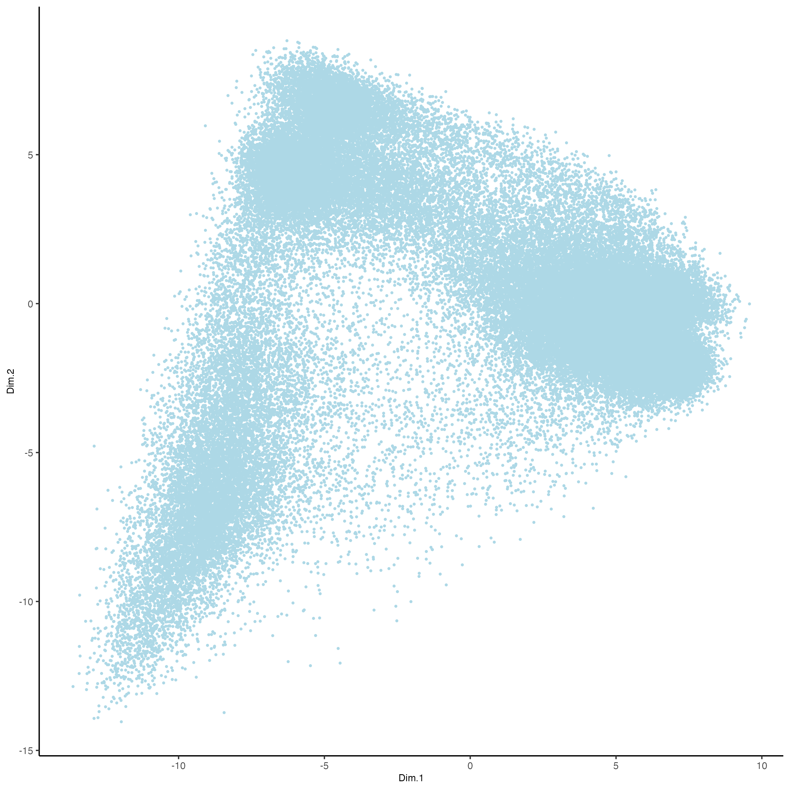
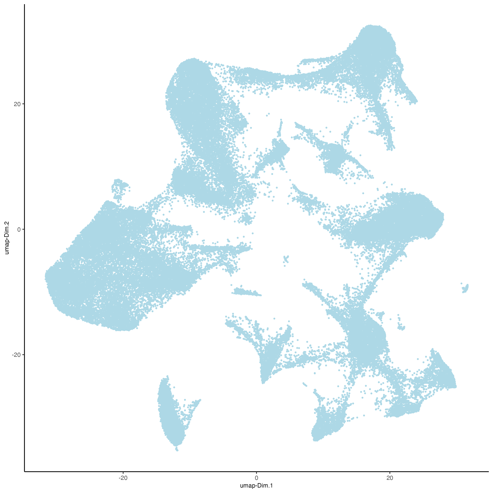
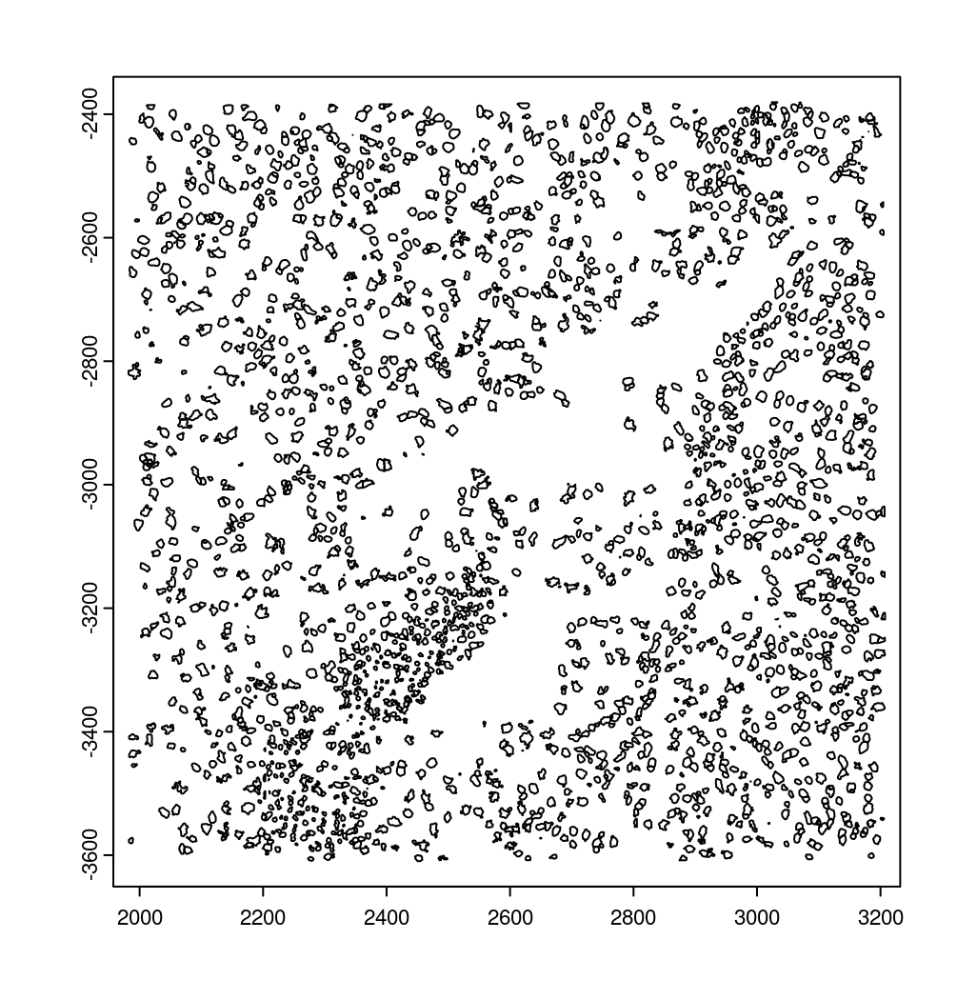
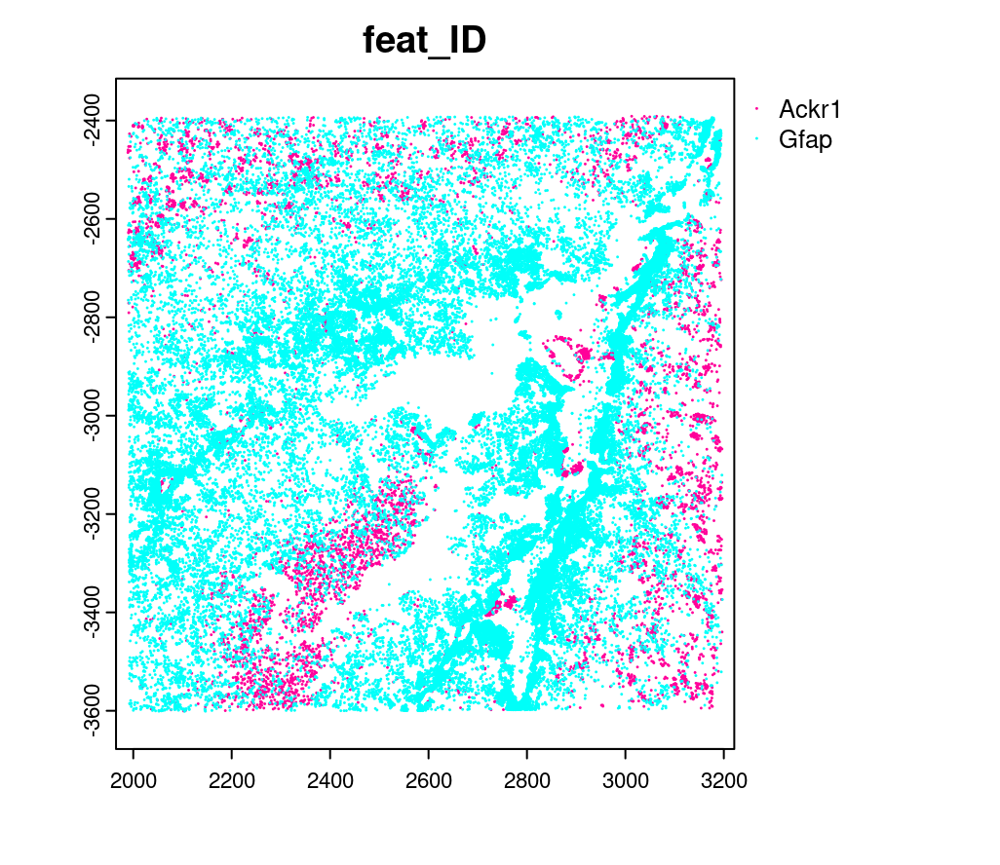
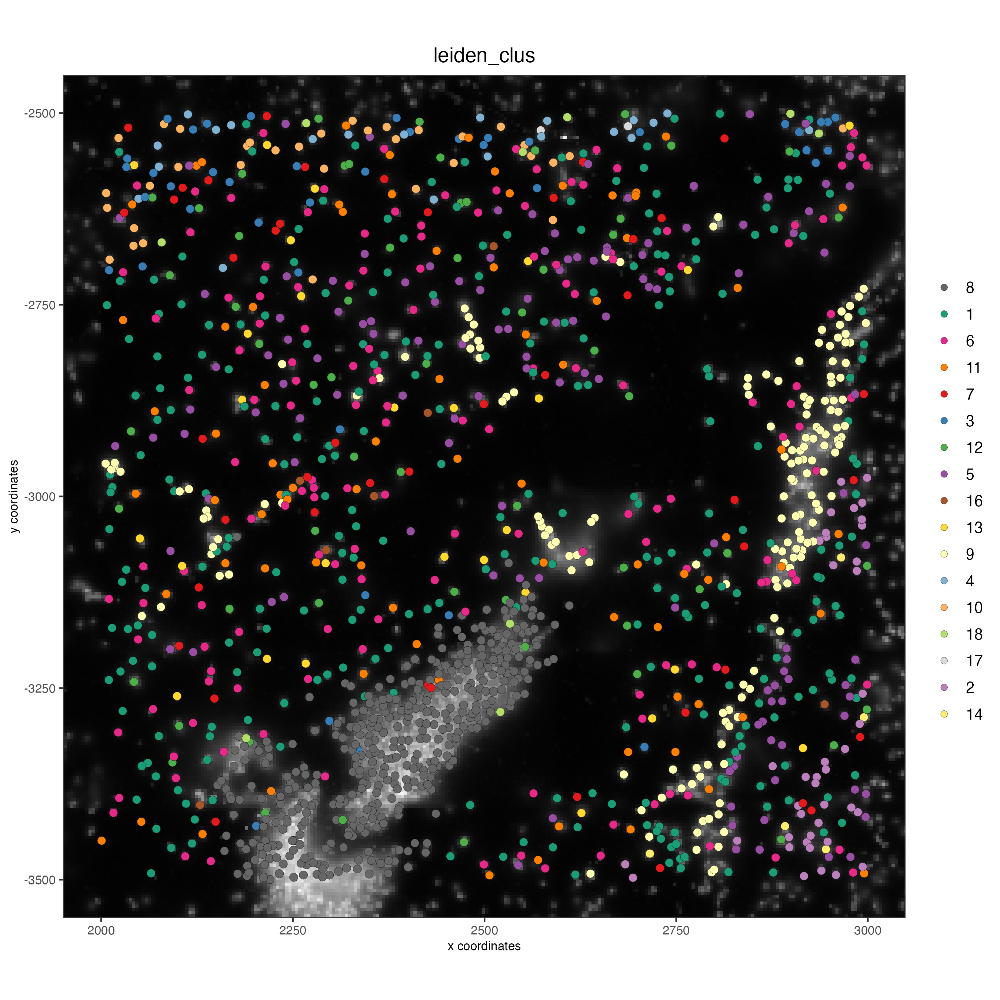
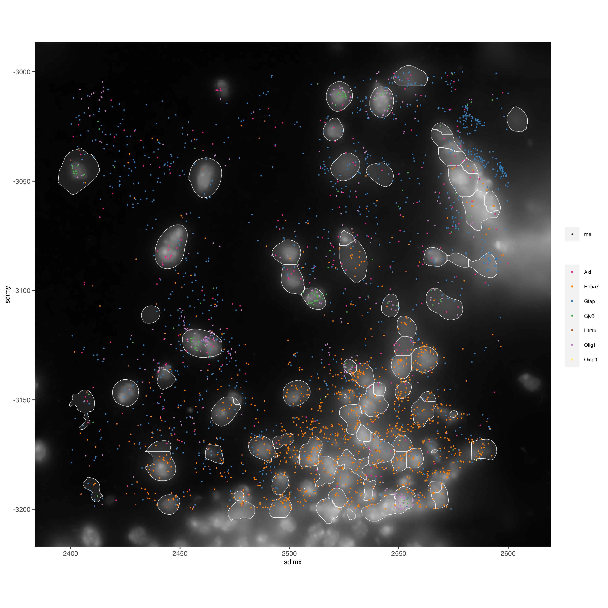

*Giotto* version `2.0.0.998`. Please check the version you are using to get the same results.

# 1. Dataset explanation

This vignette covers Giotto object creation and simple exploratory analysis with the subcellular [MERFISH Mouse Brain Receptor Map dataset](https://vizgen.com/applications/neuroscience-showcase/) provided by Vizgen with their MERSCOPE platform.

Transcripts are captured at the single-molecule level with subcellular spatial resolution (≤100nm). This dataset includes information from 9 full coronal mouse brain slices (3 positions with 3 biological replicates) that were profiled for 483 genes. This vignette works with slice 1, replicate 1.

**Provided Outputs:**

- List of all **detected transcripts** and their spatial locations in three dimensions (CSV)

Show first 4 rows

```{r, echo=FALSE}
kableExtra::kable(data.frame(V1 = c(0,1,2,3),
                             barcode_id = c(2,2,11,13),
                             global_x = c(159.9778,165.9403,158.4767,171.2179),
                             global_y = c(4208.468,4321.805,4320.901,4283.950),
                             global_z = c(4,4,5,0),
                             x = c(1762.116,1817.324,1748.217,1866.191),
                             y = c(159.9814,1209.3922,1201.0283,858.8855),
                             fov = c(0,0,0,0),
                             gene = c('Htr1b','Htr1b','Htr6','Adora1')))
```

- Output from the cell segmentation analysis:

- **transcripts** (cols) per **cell** (rows) aggregated count matrix (CSV)

Show first 4 rows and columns

```{r, echo=FALSE}
kableExtra::kable(data.frame(V1 = c(110883424764611924400221639916314253469,135188247894899244046039873973964001182,164766962839370328502017156371562646881,165747897693809971960756442245389760838),
                             Oxgr1 = c(0,0,0,0),
                             Htr1a = c(0,0,0,0),
                             Htr1b = c(0,0,0,1)))
```

- **cell metadata** (CSV)

Show first 4 rows

```{r, echo=FALSE}
kableExtra::kable(data.frame(V1 = c(110883424764611924400221639916314253469,135188247894899244046039873973964001182,164766962839370328502017156371562646881,165747897693809971960756442245389760838),
                             fov = c(0,0,0,0),
                             volume = c(432.1414,1351.8026,1080.6533,1652.0007),
                             center_x = c(156.5633,156.5093,159.9653,167.5793),
                             center_y = c(4271.326,4256.962,4228.180,4323.868),
                             min_x = c(151.5305,148.2905,152.1785,158.2265),
                             max_x = c(161.5961,164.7281,167.7521,176.9321),
                             min_y = c(4264.620,4247.664,4220.556,4314.192),
                             max_y = c(4278.033,4266.261,4235.805,4333.545)))
```  

- **cell boundaries** (HDF5)

- The **DAPI** and **Poly T mosaic images** (TIFF)

`Vizgen Data Release V1.0. May 2021`

# 2. Set up Giotto

```{r, eval=FALSE}
# Ensure Giotto Suite is installed.
if(!"Giotto" %in% installed.packages()) {
  pak::pkg_install("drieslab/Giotto")
}

# Ensure GiottoData, a small, helper module for tutorials, is installed.
if(!"GiottoData" %in% installed.packages()) {
  pak::pkg_install(("drieslab/GiottoData")
}

# Ensure the Python environment for Giotto has been installed.
genv_exists = Giotto::checkGiottoEnvironment()
if(!genv_exists){
  # The following command need only be run once to install the Giotto environment.
  Giotto::installGiottoEnvironment()
}
```

```{r, eval=FALSE}
library(Giotto)
library(GiottoData)

# 1. set working directory where project outputs will be saved to
results_folder = '/path/to/save/directory/'

# Optional: Specify a path to a Python executable within a conda or miniconda 
# environment. If set to NULL (default), the Python executable within the previously
# installed Giotto environment will be used.
my_python_path = NULL # alternatively, "/local/python/path/python" if desired.
```


# 3. Giotto global instructions and preparations

Define plot saving behavior and project data paths

```{r, eval=FALSE}
# Directly saving plots to the working directory without rendering them in the editor saves time.
instrs = createGiottoInstructions(save_dir = results_folder,
                                  save_plot = TRUE,
                                  show_plot = FALSE,
                                  return_plot = FALSE,
                                  python_path = my_python_path)

# Add Needed paths below:
# provide path to pre-aggregated information
expr_path = '/path/to/datasets_mouse_brain_map_BrainReceptorShowcase_Slice1_Replicate1_cell_by_gene_S1R1.csv'
# provide path to metadata (includes spatial locations of aggregated expression)
meta_path = '/path/to/datasets_mouse_brain_map_BrainReceptorShowcase_Slice1_Replicate1_cell_metadata_S1R1.csv'
# provide path to the detected transcripts (single molecule level transcript spatial information)
tx_path = '/path/to/datasets_mouse_brain_map_BrainReceptorShowcase_Slice1_Replicate1_detected_transcripts_S1R1.csv'
# define path to cell boundaries folder
bound_path = '/path/to/cell_boundaries'
# path to image scale conversion values
img_scale_path = 'path/to/micron_to_mosaic_pixel_transform.csv'
# provide path to the dapi image of slice 1 replicate 1
img_path = 'path/to/mosaic_DAPI_z0.tif'
```


# 4. Create Giotto object from aggregated data

Vizgen provides a cell by transcript output matrix (`cell_by_gene.csv`) with the subcellular spatial transcript information already aggregated by the provided polygon cell annotations into a count matrix.

Along with the count matrix, metadata information about the field of view (FOV), spatial location, and volume of the cell (annotation polygons) is also provided through the `cell_metadata.csv`.

**Pre-aggregated** information can be loaded into Giotto with the usual generic `createGiottoObject()` function. For starting from the raw subcellular information, skip to Section 10. To create the Giotto object, the `cell_by_gene` expression matrix and the `cell_metadata` information are first read into R. Since Giotto accepts the expression information with features (in this case genes/transcript counts) as rows and cells as columns, the expression matrix must first be transposed to create the object.

Additionally for this dataset, y values should be inverted when loaded to match the included images. For more information consult ths standard workflow at getting_started_images section.


```{r, eval=FALSE}
# read expression matrix and metadata
expr_matrix = readExprMatrix(expr_path)
meta_dt = data.table::fread(meta_path)

# create giotto object
vizgen <- createGiottoObject(expression = Giottot_flex(expr_matrix),
                             spatial_locs = meta_dt[,.(center_x, -center_y, V1)],
                             instructions = instrs)
# add metadata of fov and volume
vizgen <- addCellMetadata(vizgen,
                          new_metadata = meta_dt[,.(fov, volume)])
```

## 4.1 Visualize cells in space.

```{r, eval=FALSE}
spatPlot2D(vizgen,
           point_size = 0.5)
```


## 4.2 Visualize cells by FOV.

```{r, eval=FALSE}
# FOVs as a factor
spatPlot2D(vizgen, point_size = 0.5,
           cell_color = 'fov',
           show_legend = F)

# FOVs sequentially
spatPlot2D(vizgen, point_size = 0.5,
           cell_color = 'fov',
           color_as_factor = F,
           cell_color_gradient = c('white', 'pink', 'red'),
           show_legend = F)
```


# 5. Attaching images

Images for confocal planes z0 to z6 are provided for both **DAPI** (cell nucleus staining) and **polyT** for all datasets. A `micron_to_mosaic_pixel_transform.csv` is included within the `images` folder that provides scaling factors to map the image to the spatial coordinates. For this dataset:

micron_to_mosaic_pixel_transform.csv

```{r, echo=FALSE}
kableExtra::kable(data.frame(V1 = c(9.205861,0,0),
                             V2 = c(0,9.20585,0),
                             V3 = c(279.2204,349.8105,1)))
```


Here we will attach the z0 dapi image to the Giotto object. **Note:** It is recommended for the image files to be local. Placing the images on the cloud or network may be very slow.


```{r, eval=FALSE}
# Load in image as a giottoLargeImage object that maps spatial coordinates 1:1 with pixel coordinates
dapi0 = createGiottoLargeImage(raster_object = img_path,
                               name = 'image')

# Preview image
plot(dapi0)
```




Attaching the `giottoLargeImage` to our Giotto object (provided as a list of 1) and then updating it to map the image to the spatial coordinates which are in microns.


```{r, eval=FALSE}
# Adds the giottoLargeImage object to giotto object while also shifting values into the negatives
vizgen = addGiottoImage(gobject = vizgen,
                        largeImages = list(dapi0),
                        negative_y = TRUE)

# Read in image scale transform values
img_scale_DT = data.table::fread(img_scale_path)
x_scale = img_scale_DT$V1[[1]]
y_scale = img_scale_DT$V2[[2]]
x_shift = img_scale_DT$V3[[1]]
y_shift = -img_scale_DT$V3[[2]]

# Update image to reverse the above transformations to convert mosaic pixel to micron
# 'first_adj' means that the xy shifts are applied before the subsequent scaling
vizgen = updateGiottoLargeImage(gobject = vizgen,
                                largeImage_name = 'image',
                                x_shift = -x_shift,
                                y_shift = -y_shift,
                                scale_x = 1/x_scale,
                                scale_y = 1/y_scale,
                                order = 'first_adj')
```

## 5.1 Check image alignment

```{r, eval=FALSE}
spatPlot2D(gobject = vizgen,
           largeImage_name = 'image',
           point_size = 0.5,
           show_image = TRUE)
```


## 5.2 Zooming in by subsetting the dataset

```{r, eval=FALSE}
zoom = subsetGiottoLocs(gobject = vizgen,
                        x_min = 2000,
                        x_max = 2500,
                        y_min = -2500,
                        y_max = -2000)

spatPlot2D(gobject = zoom,
           largeImage_name = 'image',
           point_size = 1,
           show_image = TRUE)
```


# 6. Data processing

```{r, eval=FALSE}
vizgen <- filterGiotto(gobject = vizgen,
                       expression_threshold = 1,
                       feat_det_in_min_cells = 100,
                       min_det_feats_per_cell = 20)

vizgen <- normalizeGiotto(gobject = vizgen,
                          scalefactor = 1000,
                          verbose = TRUE)

# add gene and cell statistics
vizgen <- addStatistics(gobject = vizgen)
```

## 6.1 Visualize the number of features per cell.

```{r, eval=FALSE}
spatPlot2D(gobject = vizgen,
           show_image = F,
           point_alpha = 0.7,
           cell_color = 'nr_feats',
           color_as_factor = F,
           point_border_col = 'grey',
           point_border_stroke = 0.01,
           point_size = 0.5)
```


# 7. Dimension reduction

Skipping highly variable feature (HVF) detection. PCA will be calculated based on all available genes.

```{r, eval=FALSE}
vizgen <- runPCA(gobject = vizgen,
                 center = TRUE,
                 scale_unit = TRUE)
# visualize variance explained per component 
screePlot(vizgen,
          ncp = 30)
```


```{r, eval=FALSE}
plotPCA(gobject = vizgen,
        point_size = 0.5)
```



```{r, eval=FALSE}
vizgen = runUMAP(vizgen,
                 dimensions_to_use = 1:10)

plotUMAP(gobject = vizgen,
         point_size = 0.5)
```



# 8. Leiden Clustering

Calculate nearest neighbor network and perform Leiden clustering.

```{r, eval=FALSE}
vizgen <- createNearestNetwork(vizgen,
                               dimensions_to_use = 1:10,
                               k = 15)

# Default name for the results is 'leiden_clus' which is then appended to the cell metadata
vizgen <- doLeidenCluster(vizgen,
                          resolution = 0.2,
                          n_iterations = 100)
```

Cell Metadata Preview

```{r, eval=FALSE}
print(pDataDT(vizgen))
```

```{r, eval=FALSE}
cell_ID  fov    volume leiden_clus
1: 110883424764611924400221639916314253469    0  432.1414           9
2: 135188247894899244046039873973964001182    0 1351.8026           9
3: 164766962839370328502017156371562646881    0 1080.6533           9
4: 165747897693809971960756442245389760838    0 1652.0007           9
5: 260943245639750847364278545493286724628    0 1343.3786           9
---                                                                   
  78258: 165273009496786595275688065919008183969 1225 1159.6232           9
78259: 250474226357477911702383283537224741401 1225 1058.0623           9
78260:  66106840181174834341279408890707577820 1225 1155.3068           9
78261:  66165211106933093510165165316573672348 1225  394.8081           9
78262:  71051447268015582817266088343399517927 1225  798.6088           9
```

Visualize the Leiden clustering results ('leiden_clus') mapped onto the UMAP dimension reduction.

```{r, eval=FALSE}
plotUMAP(vizgen,
         cell_color = 'leiden_clus',
         point_size = 0.5)
```


Visualize the leiden clustering mapped onto the spatial data.

```{r, eval=FALSE}
spatPlot2D(gobject = vizgen,
           cell_color = 'leiden_clus',
           point_size = 0.5,
           background_color = 'black')
```


# 9. Spatial expression patterns

Spatially interesting gene expression can be detected by first generating a spatial network then performing Binary Spatial Extraction of genes.

```{r, eval=FALSE}
# create spatial network based on physical distance of cell centroids
vizgen = createSpatialNetwork(gobject = vizgen,
                              minimum_k = 2,
                              maximum_distance_delaunay = 50)

# perform Binary Spatial Extraction of genes
km_spatialgenes = binSpect(vizgen)
```

Preview km_spatialgenes

```{r, eval=FALSE}
print(km_spatialgenes$feats[1:30])
```

```{r, eval=FALSE}
[1] "Slc47a1"   "Chat"      "Th"        "Insrr"     "Slc17a7"   "Pln"      
[7] "Lmod1"     "Blank-119" "Hcar1"     "Glp1r"     "Ptgdr"     "Avpr2"    
[13] "Gpr20"     "Myh11"     "Glp2r"     "Npy2r"     "Gpr182"    "Chrm1"    
[19] "Adgrd1"    "Mrgprf"    "Trhr"      "Gfap"      "Slc17a8"   "Nmbr"     
[25] "Pth2r"     "Rxfp1"     "Musk"      "F2rl1"     "Dgkk"      "Chrm5"    
```


```{r, eval=FALSE}
# visualize spatial expression of select genes obtained from binSpect
spatFeatPlot2D(vizgen,
               expression_values = 'scaled',
               feats = km_spatialgenes$feats[c(1,2,3,5,16,22)],
               cell_color_gradient = c('blue', 'white', 'red'),
               point_shape = 'border',
               point_border_col = 'grey',
               point_border_stroke = 0.01,
               point_size = 0.2,
               cow_n_col = 2)
```


# 10. Working with subcellular information {#sec-subcellular}

*These steps may require a strong computer.*

Vizgen provides the raw information used to generate the aggregated data through the detected_transcripts.csv and cell_boundaries hdf5 files. Giotto can also work directly with this information.

## 10.1 (Optional) Define region of interest and find FOVs needed

Loading information by only grabbing the needed FOVs can cut down on computational requirements.


```{r, eval=FALSE}
subsetFOVs = meta_dt[center_x > 2000 & center_x < 3100 &
                       center_y > 2500 & center_y < 3500]$fov
subsetFOVs = unique(subsetFOVs)
```

FOVs needed

```{r, eval=FALSE}
print(subsetFOVs)
```

```{r, eval=FALSE}
[1] 220 221 222 223 224 225 245 246 247 248 249 250 275 276 277 278 279 280 302
[20] 303 304 305 306 307 330 331 332 333 334 335 358 359 360 361 362 363
```

**Note:** The following steps will be assuming that this step was run.

## 10.2 Creating a giottoPolygon object

Cell boundary annotations are represented in Giotto as `giottoPolygon` objects which can be previewed by directly plotting them.

```{r, eval=FALSE}
# read polygons and add them to Giotto
# fovs param is optional
# polygon_feat_types determines which Vizgen polygon z slices are loaded (There are 0 - 6)
polys = readPolygonFilesVizgenHDF5(boundaries_path = bound_path,
                                   polygon_feat_types = c(0,6),
                                   flip_y_axis = TRUE,
                                   fovs = subsetFOVs)

# polys is produced as a list of 2 giottoPolygon objects (z0 and z6)
# previewing the first one...
plot(polys[[1]])
```



## 10.3 Creating a giottoPoints object

Giotto represents single-molecule transcript level spatial data as `giottoPoints` objects.

```{r, eval=FALSE}
tx_dt = data.table::fread(tx_path)
# select transcripts in FOVs
tx_dt_selected = tx_dt[fov %in% subsetFOVs]
tx_dt_selected$global_y = -tx_dt_selected$global_y
# (note the inverted y is the same as when spatial locations were loaded)

# create Giotto points from transcripts 
gpoints = createGiottoPoints(x = tx_dt_selected[,.(global_x, global_y, gene, global_z)])

# preview the giottoPoints object (Including specific feats to plot is highly recommended)
# Not providing the feats param will plot ALL features detected
plot(gpoints,
     feats = c('Gfap', 'Ackr1'),
     point_size = 0.1)
```



## 10.4 Creating a subcellular Giotto object

```{r, eval=FALSE}
# Create new giotto instructions to set different save directory if desired
# instrs_sub = createGiottoInstructions(show_plot = FALSE,
#                                       return_plot = FALSE,
#                                       save_plot = TRUE,
#                                       save_dir = "path/to/subcellular/save/folder")

vizgen_subcellular = createGiottoObjectSubcellular(gpoints = list(rna = gpoints),
                                                   gpolygons = polys,
                                                   # instructions = instrs_sub
)

# Find polygon centroids and generate associated spatial locations
vizgen_subcellular = addSpatialCentroidLocations(vizgen_subcellular,
                                                 poly_info = c('z0', 'z6'))


# Append images **(Details about these functions can be found in step 5)**
# Run following two commented lines if skipping to this step
# dapi0 = createGiottoLargeImage(raster_object = img_path, name = 'image')
# img_scale_DT = data.table::fread(img_scale_path)
vizgen_subcellular = addGiottoImage(gobject = vizgen_subcellular,
                                    largeImages = list(dapi0), negative_y = TRUE)
x_scale = img_scale_DT$V1[[1]] ; y_scale = img_scale_DT$V2[[2]]
x_shift = img_scale_DT$V3[[1]] ; y_shift = -img_scale_DT$V3[[2]]
vizgen_subcellular = updateGiottoLargeImage(gobject = vizgen_subcellular,
                                            largeImage_name = 'image', x_shift = -x_shift, y_shift = -y_shift,
                                            scale_x = 1/x_scale, scale_y = 1/y_scale, order = 'first_adj')
```

Alternatively to append subcellular data to existing giotto object.

The subcellular information can also be attached to giotto objects built with the pre-aggregated information.

```{r, eval=FALSE}
# Subset dataset to work with smaller area
vizgen_subset = subsetGiottoLocs(vizgen,
                                 x_min = 2000, x_max = 3000,
                                 y_min = -3500, y_max = -2500)

# add points to Giotto object
vizgen_subset = addGiottoPoints(gobject = vizgen_subset,
                                gpoints = list(rna = gpoints))
# There will be a warning that 14 features are not present in vizgen_subset
# (They were previously removed during data processing in step 6)

# add polygons to Giotto object
vizgen_subset = addGiottoPolygons(gobject = vizgen_subset,
                                  gpolygons = polys)
# If the polygons had not already been read readPolygonFilesVizgen() should be used instead
# vizgen_subset = readPolygonFilesVizgen(gobject = vizgen_subset,
# boundaries_path = bound_path,
# polygon_feat_types = c(0,6)) # Defines which z slices (polys) are read in

# Calculate centroid locations
vizgen_subset = addSpatialCentroidLocations(vizgen_subset,
                                            poly_info = c('z0', 'z6'))
```

**Visualize subset**

```{r, eval=FALSE}
spatPlot2D(gobject = vizgen_subset,
           show_image = TRUE,
           largeImage_name = 'image',
           cell_color = 'leiden_clus',
           point_size = 2.5)
```



```{r, eval=FALSE}
# identify genes for visualization
gene_meta = fDataDT(vizgen_subset)
data.table::setorder(gene_meta, perc_cells)
gene_meta[perc_cells > 25 & perc_cells < 50]

# visualize points with z0 polygons (confocal plane)
spatInSituPlotPoints(vizgen_subset,
                     feats = list('rna' = c("Oxgr1", "Htr1a", "Gjc3", "Axl",
                                            'Gfap', "Olig1", "Epha7")),
                     polygon_feat_type = 'z0',
                     use_overlap = FALSE,
                     point_size = 0.1,
                     polygon_line_size = 1,
                     show_polygon = TRUE,
                     polygon_bg_color = 'white',
                     polygon_color = 'white')
```


```{r, eval=FALSE}
# visualize select genes with z0 polygons (confocal plane)
spatInSituPlotPoints(vizgen_subcellular,
                     feats = list('rna' = c("Oxgr1", "Htr1a", "Gjc3", "Axl",
                                            'Gfap', "Olig1", "Epha7")),
                     polygon_feat_type = 'z0',
                     use_overlap = FALSE,
                     point_size = 0.1,
                     polygon_line_size = 0.1,
                     show_polygon = TRUE,
                     polygon_bg_color = 'white',
                     polygon_color = 'white',
                     coord_fix_ratio = TRUE,
                     save_param = list(base_height = 10,
                                       base_width = 10))
```


```{r, eval=FALSE}
# Zoom in further and visualize with image
vizgen_subcellular_zoom = subsetGiottoLocs(vizgen_subcellular,
                                           poly_info = c('z0','z6'),
                                           x_min = 2400, x_max = 2600,
                                           y_min = -3200, y_max = -3000)

spatInSituPlotPoints(vizgen_subcellular_zoom,
                     feats = list('rna' = c("Oxgr1", "Htr1a", "Gjc3", "Axl",
                                            'Gfap', "Olig1", "Epha7")),
                     polygon_feat_type = 'z0',
                     use_overlap = FALSE,
                     point_size = 0.5,
                     polygon_line_size = 0.2,
                     show_polygon = TRUE,
                     polygon_bg_color = 'white',
                     polygon_color = 'white',
                     polygon_alpha = 0.1,
                     show_image = TRUE,
                     largeImage_name = 'image',
                     coord_fix_ratio = TRUE,
                     save_param = list(base_height = 10,
                                       base_width = 10))
```


```{r, eval=FALSE}
spatInSituPlotPoints(vizgen_subcellular_zoom,
                     feats = list('rna' = c("Oxgr1", "Htr1a", "Gjc3", "Axl",
                                            'Gfap', "Olig1", "Epha7")),
                     polygon_feat_type = 'z6', # Use polygon from z slice 6 this time
                     use_overlap = FALSE,
                     point_size = 0.5,
                     polygon_line_size = 0.2,
                     show_polygon = TRUE,
                     polygon_bg_color = 'white',
                     polygon_color = 'white',
                     polygon_alpha = 0.1,
                     show_image = TRUE,
                     largeImage_name = 'image',
                     coord_fix_ratio = TRUE,
                     save_param = list(base_height = 10,
                                       base_width = 10))
```



