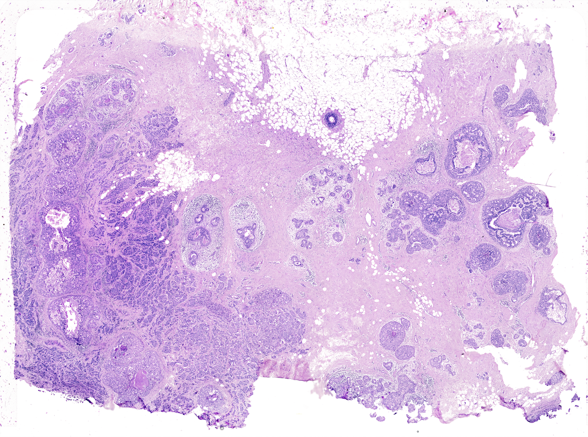
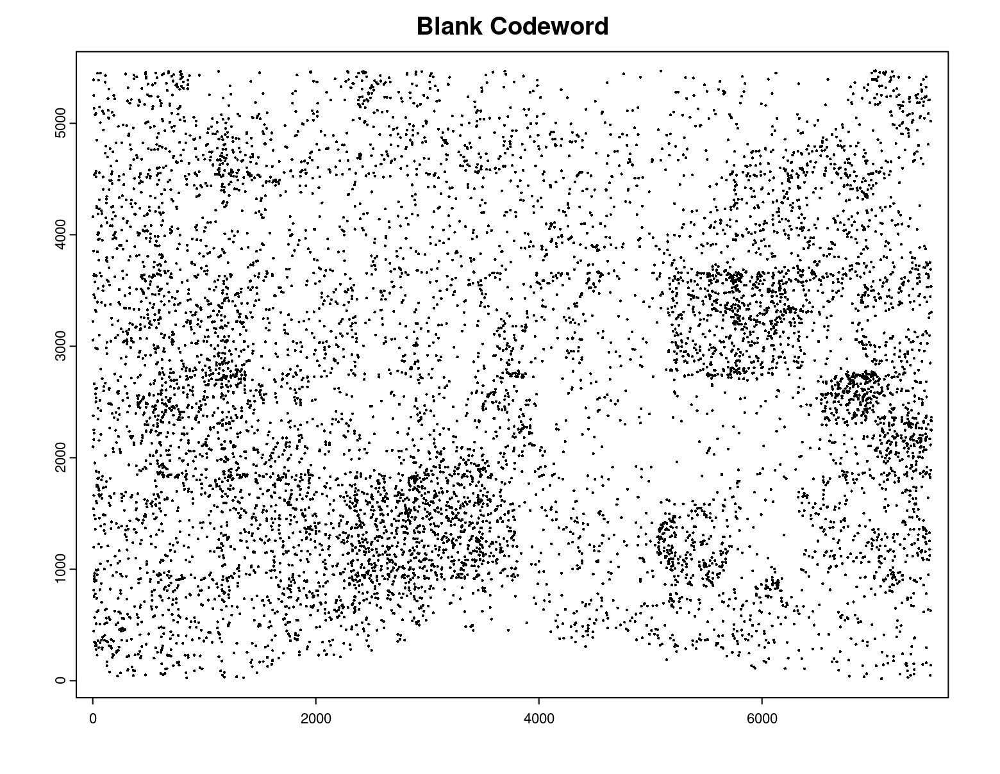
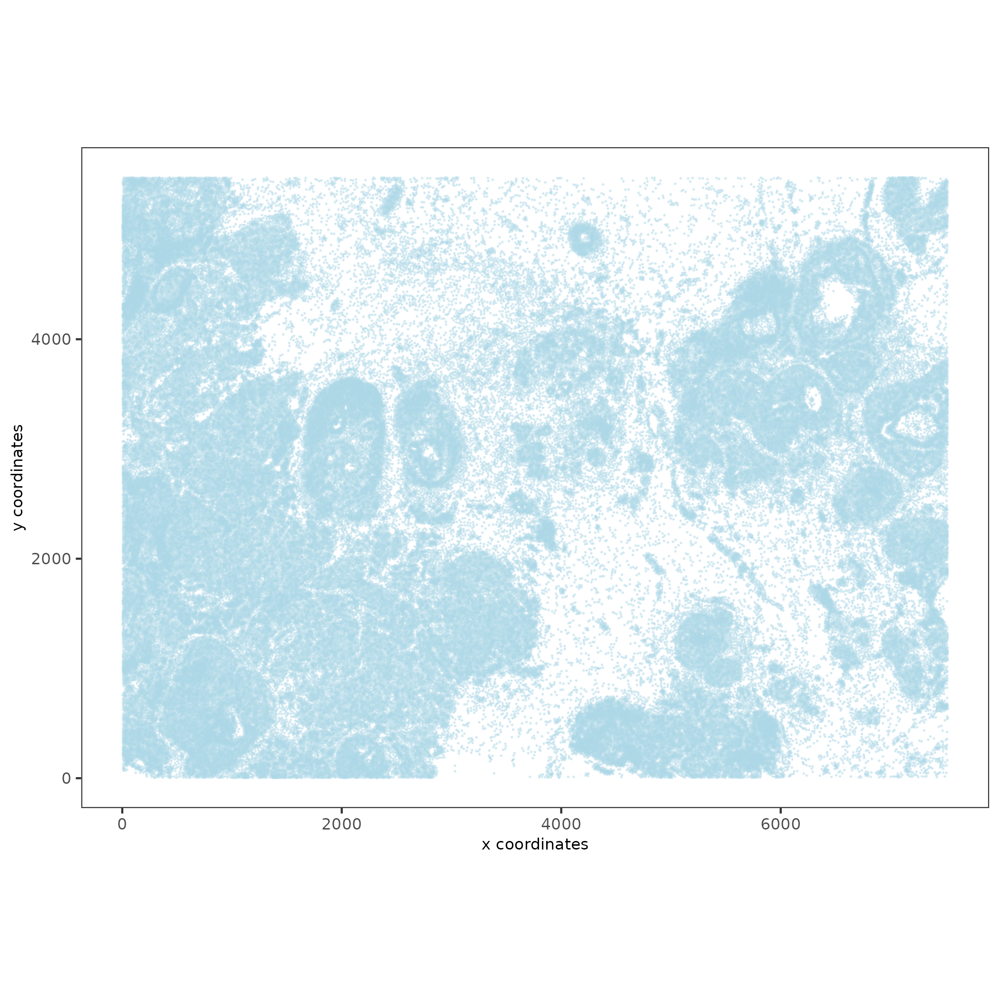
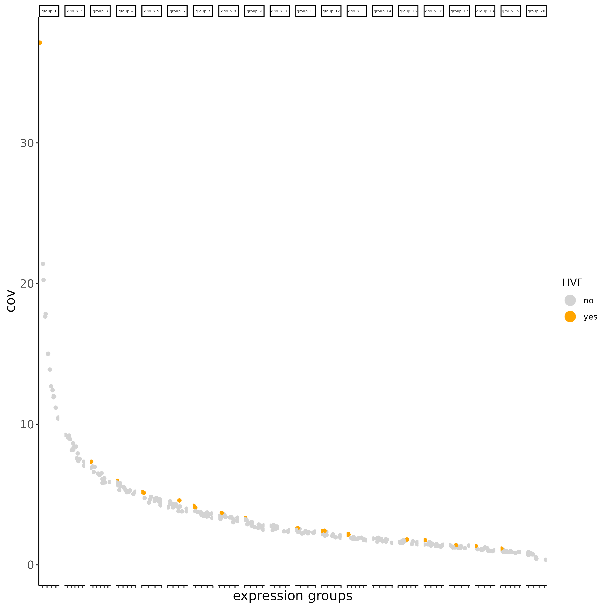
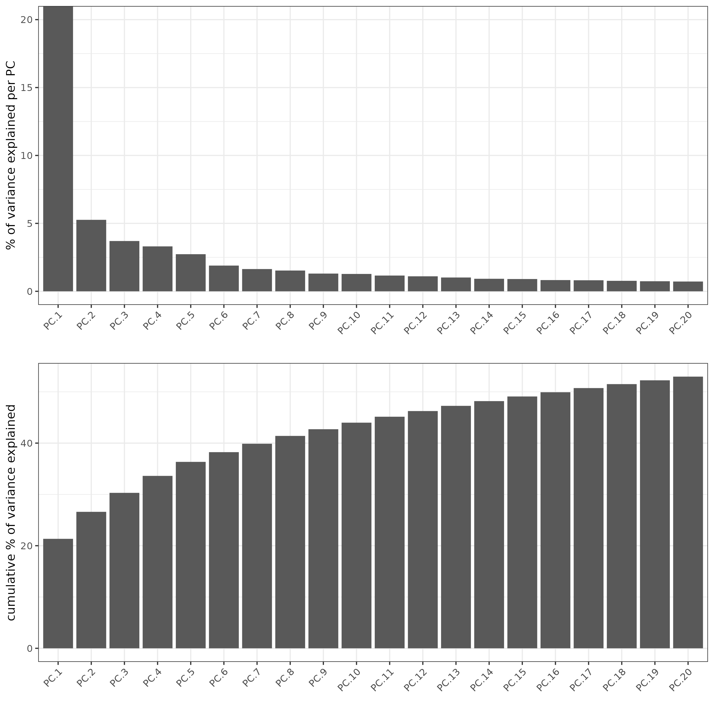
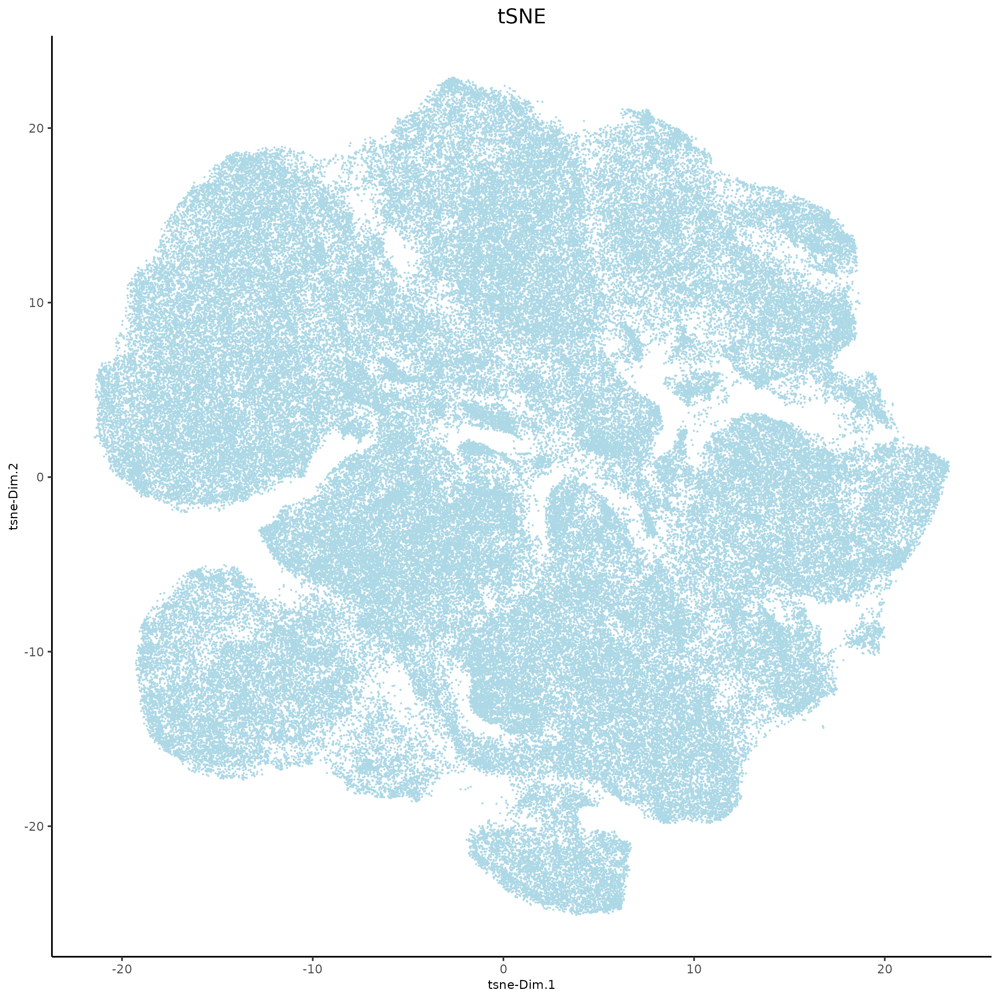
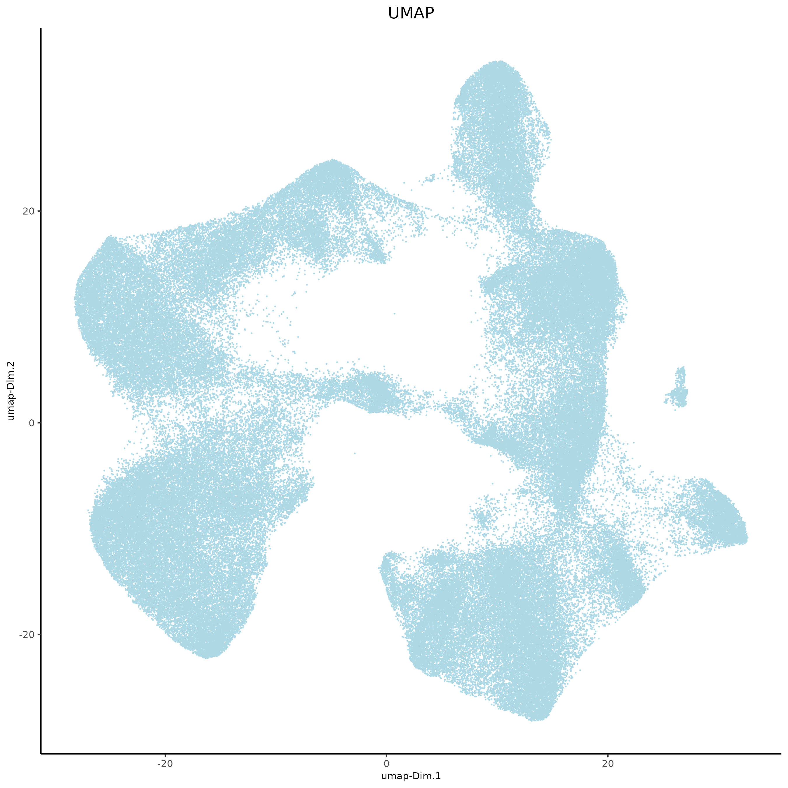
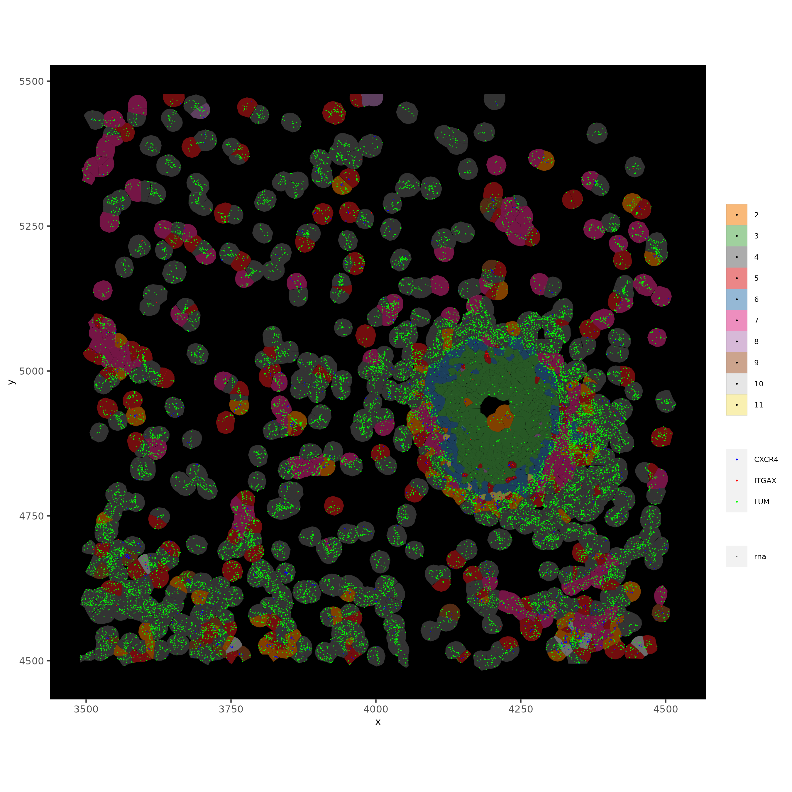

# 1. Set up Giotto environment

```{r, eval=FALSE}
# Ensure Giotto Suite is installed.
if(!"Giotto" %in% installed.packages()) {
  pak::pkg_install("drieslab/Giotto")
}

# Ensure the Python environment for Giotto has been installed.
genv_exists = Giotto::checkGiottoEnvironment()
if(!genv_exists){
  # The following command need only be run once to install the Giotto environment.
  Giotto::installGiottoEnvironment()
}
```

```{r, eval=FALSE}
library(Giotto)

# 1. ** SET WORKING DIRECTORY WHERE PROJECT OUPUTS WILL SAVE TO **
results_folder = '/path/to/save/directory/'

# 2. set giotto python path
# set python path to your preferred python version path
# set python path to NULL if you want to automatically install (only the 1st time) and use the giotto miniconda environment
python_path = NULL 
if(is.null(python_path)) {
  installGiottoEnvironment()
}

# 3. Create Giotto instructions
# Directly saving plots to the working directory without rendering them in the editor saves time.
instrs = createGiottoInstructions(save_dir = results_folder,
                                  save_plot = TRUE,
                                  show_plot = FALSE,
                                  return_plot = FALSE)
```


# 2. Dataset explanation

This vignette covers Giotto object creation and simple exploratory analysis with 10x Genomics' subcellular *Xenium In Situ* platform data using their [Human Breast Cancer Dataset](https://www.10xgenomics.com/products/xenium-in-situ/preview-dataset-human-breast) provided with their recent [bioRxiv
pre-print](https://www.biorxiv.org/content/10.1101/2022.10.06.510405v1). 

The data from the first tissue replicate will be worked with:



# 3. Project data paths

Xenium's exact output folder structure and which file/formats will be available in the final release are still subject to change. This tutorial will be updated for any differences at release.

**Note:** The cell_feature_matrix.tar.gz must be unpacked into a subdirectory within the xenium working directory before starting.


```{r, eval=FALSE}
# ** SET PATH TO FOLDER CONTAINING XENIUM DATA **
xenium_folder = '/path/to/xenium/data/outputs'

# general files (some are supplemental files)
settings_path = paste0(xenium_folder, 'experiment.xenium')
he_img_path = paste0(xenium_folder, 'Xenium_FFPE_Human_Breast_Cancer_Rep1_he_image.tif')
if_img_path = paste0(xenium_folder, 'Xenium_FFPE_Human_Breast_Cancer_Rep1_if_image.tif')
panel_meta_path = paste0(xenium_folder, 'Xenium_FFPE_Human_Breast_Cancer_Rep1_panel.tsv') # (optional)

# files (SUBCELLULAR): (tutorial focuses on working with these files)
cell_bound_path = paste0(xenium_folder, 'cell_boundaries.csv.gz')
nuc_bound_path = paste0(xenium_folder, 'nucleus_boundaries.csv.gz')
tx_path = paste0(xenium_folder, 'transcripts.csv.gz')
feat_meta_path = paste0(xenium_folder, 'cell_feature_matrix/features.tsv.gz') # (also used in aggregate)

# files (AGGREGATE):
expr_mat_path = paste0(xenium_folder, 'cell_feature_matrix')
cell_meta_path = paste0(xenium_folder, 'cells.csv.gz') # contains spatlocs
```


# 4. Xenium feature types exploration

`features.tsv.gz` within `cell_feature_matrix.tar.gz` provides  information on the different feature types available within Xenium's two types of expression outputs:

1. aggregated cell by feature matrix
2. transcript detections in `transcripts.csv.gz`

There are four types of probes used, each of which is represented in both exports:

- `gene expression`: Gene expression detection
- `blank codeword`: Unused codeword - there are no probes that will generate the codeword
- `negative control codeword`: Valid codewords that do not have any probes that should yield that code, so they can be used to assess the specificity of the decoding algorithm
- `negative control probe`: Probes that exist in the panel, but target ERCC or other non-biological sequences, which can be used to assess the specificity of the assay


```{r, eval=FALSE}
# load features metadata
# (make sure cell_feature_matrix folder is unpacked)
feature_dt = data.table::fread(feat_meta_path, header = FALSE)
colnames(feature_dt) = c('ensembl_ID','feat_name','feat_type')

# find the feature IDs that belong to each feature type
feature_dt[, table(feat_type)]
feat_types = names(feature_dt[, table(feat_type)])

feat_types_IDs = lapply(
  feat_types, function(type) feature_dt[feat_type == type, unique(feat_name)]
)
names(feat_types_IDs) = feat_types
```


```{r, eval=FALSE}
# feat_type
#            Blank Codeword           Gene Expression
#                       159                       313
#            Negative Control Codeword    Negative Control Probe 
#                                   41                        28 
```


This dataset has 313 probes that are dedicated for gene expression transcript detection.


```{r, eval=FALSE}
#   [1] "ABCC11"   "ACTA2"    "ACTG2"    "ADAM9"    "ADGRE5"   "ADH1B"   
#   [7] "ADIPOQ"   "AGR3"     "AHSP"     "AIF1"     "AKR1C1"   "AKR1C3"  
#  [13] "ALDH1A3"  "ANGPT2"   "ANKRD28"  "ANKRD29"  "ANKRD30A" "APOBEC3A"
#  [19] "APOBEC3B" "APOC1"    "AQP1"     "AQP3"     "AR"       "AVPR1A"  
#  [25] "BACE2"    "BANK1"    "BASP1"    "BTNL9"    "C15orf48" "C1QA"    
#  [31] "C1QC"     "C2orf42"  "C5orf46"  "C6orf132" "CAV1"     "CAVIN2"  
#  [37] "CCDC6"    "CCDC80"   "CCL20"    "CCL5"     "CCL8"     "CCND1"   
#  [43] "CCPG1"    "CCR7"     "CD14"     "CD163"    "CD19"     "CD1C"    
#  [49] "CD247"    "CD27"     "CD274"    "CD3D"     "CD3E"     "CD3G"    
#  [55] "CD4"      "CD68"     "CD69"     "CD79A"    "CD79B"    "CD80"    
#  [61] "CD83"     "CD86"     "CD8A"     "CD8B"     "CD9"      "CD93"    
#  [67] "CDC42EP1" "CDH1"     "CEACAM6"  "CEACAM8"  "CENPF"    "CLCA2"   
#  [73] "CLDN4"    "CLDN5"    "CLEC14A"  "CLEC9A"   "CLECL1"   "CLIC6"   
#  [79] "CPA3"     "CRHBP"    "CRISPLD2" "CSF3"     "CTH"      "CTLA4"   
#  [85] "CTSG"     "CTTN"     "CX3CR1"   "CXCL12"   "CXCL16"   "CXCL5"   
#  [91] "CXCR4"    "CYP1A1"   "CYTIP"    "DAPK3"    "DERL3"    "DMKN"    
#  [97] "DNAAF1"   "DNTTIP1"  "DPT"      "DSC2"     "DSP"      "DST"     
# [103] "DUSP2"    "DUSP5"    "EDN1"     "EDNRB"    "EGFL7"    "EGFR"    
# [109] "EIF4EBP1" "ELF3"     "ELF5"     "ENAH"     "EPCAM"    "ERBB2"   
# [115] "ERN1"     "ESM1"     "ESR1"     "FAM107B"  "FAM49A"   "FASN"    
# [121] "FBLIM1"   "FBLN1"    "FCER1A"   "FCER1G"   "FCGR3A"   "FGL2"    
# [127] "FLNB"     "FOXA1"    "FOXC2"    "FOXP3"    "FSTL3"    "GATA3"   
# [133] "GJB2"     "GLIPR1"   "GNLY"     "GPR183"   "GZMA"     "GZMB"    
# [139] "GZMK"     "HAVCR2"   "HDC"      "HMGA1"    "HOOK2"    "HOXD8"   
# [145] "HOXD9"    "HPX"      "IGF1"     "IGSF6"    "IL2RA"    "IL2RG"   
# [151] "IL3RA"    "IL7R"     "ITGAM"    "ITGAX"    "ITM2C"    "JUP"     
# [157] "KARS"     "KDR"      "KIT"      "KLF5"     "KLRB1"    "KLRC1"   
# [163] "KLRD1"    "KLRF1"    "KRT14"    "KRT15"    "KRT16"    "KRT23"   
# [169] "KRT5"     "KRT6B"    "KRT7"     "KRT8"     "LAG3"     "LARS"    
# [175] "LDHB"     "LEP"      "LGALSL"   "LIF"      "LILRA4"   "LPL"     
# [181] "LPXN"     "LRRC15"   "LTB"      "LUM"      "LY86"     "LYPD3"   
# [187] "LYZ"      "MAP3K8"   "MDM2"     "MEDAG"    "MKI67"    "MLPH"    
# [193] "MMP1"     "MMP12"    "MMP2"     "MMRN2"    "MNDA"     "MPO"     
# [199] "MRC1"     "MS4A1"    "MUC6"     "MYBPC1"   "MYH11"    "MYLK"    
# [205] "MYO5B"    "MZB1"     "NARS"     "NCAM1"    "NDUFA4L2" "NKG7"    
# [211] "NOSTRIN"  "NPM3"     "OCIAD2"   "OPRPN"    "OXTR"     "PCLAF"   
# [217] "PCOLCE"   "PDCD1"    "PDCD1LG2" "PDE4A"    "PDGFRA"   "PDGFRB"  
# [223] "PDK4"     "PECAM1"   "PELI1"    "PGR"      "PIGR"     "PIM1"    
# [229] "PLD4"     "POLR2J3"  "POSTN"    "PPARG"    "PRDM1"    "PRF1"    
# [235] "PTGDS"    "PTN"      "PTPRC"    "PTRHD1"   "QARS"     "RAB30"   
# [241] "RAMP2"    "RAPGEF3"  "REXO4"    "RHOH"     "RORC"     "RTKN2"   
# [247] "RUNX1"    "S100A14"  "S100A4"   "S100A8"   "SCD"      "SCGB2A1" 
# [253] "SDC4"     "SEC11C"   "SEC24A"   "SELL"     "SERHL2"   "SERPINA3"
# [259] "SERPINB9" "SFRP1"    "SFRP4"    "SH3YL1"   "SLAMF1"   "SLAMF7"  
# [265] "SLC25A37" "SLC4A1"   "SLC5A6"   "SMAP2"    "SMS"      "SNAI1"   
# [271] "SOX17"    "SOX18"    "SPIB"     "SQLE"     "SRPK1"    "SSTR2"   
# [277] "STC1"     "SVIL"     "TAC1"     "TACSTD2"  "TCEAL7"   "TCF15"   
# [283] "TCF4"     "TCF7"     "TCIM"     "TCL1A"    "TENT5C"   "TFAP2A"  
# [289] "THAP2"    "TIFA"     "TIGIT"    "TIMP4"    "TMEM147"  "TNFRSF17"
# [295] "TOMM7"    "TOP2A"    "TPD52"    "TPSAB1"   "TRAC"     "TRAF4"   
# [301] "TRAPPC3"  "TRIB1"    "TUBA4A"   "TUBB2B"   "TYROBP"   "UCP1"    
# [307] "USP53"    "VOPP1"    "VWF"      "WARS"     "ZEB1"     "ZEB2"    
# [313] "ZNF562"  
```


```{r, eval=FALSE}
#   [1] "BLANK_0006" "BLANK_0013" "BLANK_0037" "BLANK_0069" "BLANK_0072"
#   [6] "BLANK_0087" "BLANK_0110" "BLANK_0114" "BLANK_0120" "BLANK_0147"
#  [11] "BLANK_0180" "BLANK_0186" "BLANK_0272" "BLANK_0278" "BLANK_0319"
#  [16] "BLANK_0321" "BLANK_0337" "BLANK_0350" "BLANK_0351" "BLANK_0352"
#  [21] "BLANK_0353" "BLANK_0354" "BLANK_0355" "BLANK_0356" "BLANK_0357"
#  [26] "BLANK_0358" "BLANK_0359" "BLANK_0360" "BLANK_0361" "BLANK_0362"
#  [31] "BLANK_0363" "BLANK_0364" "BLANK_0365" "BLANK_0366" "BLANK_0367"
#  [36] "BLANK_0368" "BLANK_0369" "BLANK_0370" "BLANK_0371" "BLANK_0372"
#  [41] "BLANK_0373" "BLANK_0374" "BLANK_0375" "BLANK_0376" "BLANK_0377"
#  [46] "BLANK_0378" "BLANK_0379" "BLANK_0380" "BLANK_0381" "BLANK_0382"
#  [51] "BLANK_0383" "BLANK_0384" "BLANK_0385" "BLANK_0386" "BLANK_0387"
#  [56] "BLANK_0388" "BLANK_0389" "BLANK_0390" "BLANK_0391" "BLANK_0392"
#  [61] "BLANK_0393" "BLANK_0394" "BLANK_0395" "BLANK_0396" "BLANK_0397"
#  [66] "BLANK_0398" "BLANK_0399" "BLANK_0400" "BLANK_0401" "BLANK_0402"
#  [71] "BLANK_0403" "BLANK_0404" "BLANK_0405" "BLANK_0406" "BLANK_0407"
#  [76] "BLANK_0408" "BLANK_0409" "BLANK_0410" "BLANK_0411" "BLANK_0412"
#  [81] "BLANK_0413" "BLANK_0414" "BLANK_0415" "BLANK_0416" "BLANK_0417"
#  [86] "BLANK_0418" "BLANK_0419" "BLANK_0420" "BLANK_0421" "BLANK_0422"
#  [91] "BLANK_0423" "BLANK_0424" "BLANK_0425" "BLANK_0426" "BLANK_0427"
#  [96] "BLANK_0428" "BLANK_0429" "BLANK_0430" "BLANK_0431" "BLANK_0432"
# [101] "BLANK_0433" "BLANK_0434" "BLANK_0435" "BLANK_0436" "BLANK_0437"
# [106] "BLANK_0438" "BLANK_0439" "BLANK_0440" "BLANK_0441" "BLANK_0442"
# [111] "BLANK_0443" "BLANK_0444" "BLANK_0445" "BLANK_0446" "BLANK_0447"
# [116] "BLANK_0448" "BLANK_0449" "BLANK_0450" "BLANK_0451" "BLANK_0452"
# [121] "BLANK_0453" "BLANK_0454" "BLANK_0455" "BLANK_0456" "BLANK_0457"
# [126] "BLANK_0458" "BLANK_0459" "BLANK_0460" "BLANK_0461" "BLANK_0462"
# [131] "BLANK_0463" "BLANK_0464" "BLANK_0465" "BLANK_0466" "BLANK_0467"
# [136] "BLANK_0468" "BLANK_0469" "BLANK_0470" "BLANK_0471" "BLANK_0472"
# [141] "BLANK_0473" "BLANK_0474" "BLANK_0475" "BLANK_0476" "BLANK_0477"
# [146] "BLANK_0478" "BLANK_0479" "BLANK_0480" "BLANK_0481" "BLANK_0482"
# [151] "BLANK_0483" "BLANK_0484" "BLANK_0485" "BLANK_0486" "BLANK_0487"
# [156] "BLANK_0488" "BLANK_0489" "BLANK_0497" "BLANK_0499"
```


```{r, eval=FALSE}
#  [1] "NegControlCodeword_0500" "NegControlCodeword_0501"
#  [3] "NegControlCodeword_0502" "NegControlCodeword_0503"
#  [5] "NegControlCodeword_0504" "NegControlCodeword_0505"
#  [7] "NegControlCodeword_0506" "NegControlCodeword_0507"
#  [9] "NegControlCodeword_0508" "NegControlCodeword_0509"
# [11] "NegControlCodeword_0510" "NegControlCodeword_0511"
# [13] "NegControlCodeword_0512" "NegControlCodeword_0513"
# [15] "NegControlCodeword_0514" "NegControlCodeword_0515"
# [17] "NegControlCodeword_0516" "NegControlCodeword_0517"
# [19] "NegControlCodeword_0518" "NegControlCodeword_0519"
# [21] "NegControlCodeword_0520" "NegControlCodeword_0521"
# [23] "NegControlCodeword_0522" "NegControlCodeword_0523"
# [25] "NegControlCodeword_0524" "NegControlCodeword_0525"
# [27] "NegControlCodeword_0526" "NegControlCodeword_0527"
# [29] "NegControlCodeword_0528" "NegControlCodeword_0529"
# [31] "NegControlCodeword_0530" "NegControlCodeword_0531"
# [33] "NegControlCodeword_0532" "NegControlCodeword_0533"
# [35] "NegControlCodeword_0534" "NegControlCodeword_0535"
# [37] "NegControlCodeword_0536" "NegControlCodeword_0537"
# [39] "NegControlCodeword_0538" "NegControlCodeword_0539"
# [41] "NegControlCodeword_0540"
```


```{r, eval=FALSE}
#  [1] "NegControlProbe_00042" "NegControlProbe_00041" "NegControlProbe_00039"
#  [4] "NegControlProbe_00035" "NegControlProbe_00034" "NegControlProbe_00033"
#  [7] "NegControlProbe_00031" "NegControlProbe_00025" "NegControlProbe_00024"
# [10] "NegControlProbe_00022" "NegControlProbe_00019" "NegControlProbe_00017"
# [13] "NegControlProbe_00016" "NegControlProbe_00014" "NegControlProbe_00013"
# [16] "NegControlProbe_00012" "NegControlProbe_00009" "NegControlProbe_00004"
# [19] "NegControlProbe_00003" "NegControlProbe_00002" "antisense_PROKR2"     
# [22] "antisense_ULK3"        "antisense_SCRIB"       "antisense_TRMU"       
# [25] "antisense_MYLIP"       "antisense_LGI3"        "antisense_BCL2L15"    
# [28] "antisense_ADCY4"   
```


# 5. Loading Xenium data

## 5.1 Manual Method

Giotto objects can be manually assembled feeding data and subobjects into a creation function. A convenience function for automatically loading the xenium data from the directory and generating a giotto object is also available. (See Section 5.2])

Xenium outputs can be analyzed as either the subcellular information or as aggregated data where each detected cell's subcellular data has been spatially assigned to a cell centroid. This tutorial will work mainly with the subcellular data and how to work with it, however a workflow to load in just the aggregated data is also available through the convenience function.

### 5.1.1 Load transcript-level data

`transcripts.csv.gz` is a file containing x, y, z coordinates for individual transcript molecules detected during the Xenium run. It also contains a QC Phred score for which this tutorial will set a cutoff at 20, the same as what 10x uses.


```{r, eval=FALSE}
tx_dt = data.table::fread(tx_path)
data.table::setnames(x = tx_dt,
                     old = c('feature_name', 'x_location', 'y_location'),
                     new = c('feat_ID', 'x', 'y'))
cat('Transcripts info available:\n ', paste0('"', colnames(tx_dt), '"'), '\n',
    'with', tx_dt[,.N], 'unfiltered detections\n')

# filter by qv (Phred score)
tx_dt_filtered = tx_dt[qv >= 20]
cat('and', tx_dt_filtered[,.N], 'filtered detections\n\n')

# separate detections by feature type
tx_dt_types = lapply(
  feat_types_IDs, function(types) tx_dt_filtered[feat_ID %in% types]
)

invisible(lapply(seq_along(tx_dt_types), function(x) {
  cat(names(tx_dt_types)[[x]], 'detections: ', tx_dt_types[[x]][,.N], '\n')
}))
```


```{r, eval=FALSE}
# Transcripts info available:
#   "transcript_id" "cell_id" "overlaps_nucleus" "feat_ID" "x" "y" "z_location" "qv" 
#  with 43664530 unfiltered detections
#  and 34813341 filtered detections
# 
# Blank Codeword detections: 8805 
# Gene Expression detections: 34764833 
# Negative Control Codeword detections: 1855 
# Negative Control Probe detections: 37848 
```


Giotto loads these filtered subcellular detections in as a `giottoPoints` object and determines the correct columns by looking   for columns named `'feat_ID',` `'x'`, and `'y'`.

Here, we use the list of `data.table`s generated in the previous step to create a list of `giottoPoints` objects. When previewing these objects using `plot()`, the default behavior is to plot ALL points within the object. For objects that contain many feature points, it is highly recommended to specify a subset of features to plot using the `feats` param.


```{r, eval=FALSE}
gpoints_list = lapply(
  tx_dt_types, function(x) createGiottoPoints(x = x)
) # 208.499 sec elapsed

# preview QC probe detections
plot(gpoints_list$`Blank Codeword`,
     point_size = 0.3,
     main = 'Blank Codeword')
plot(gpoints_list$`Negative Control Codeword`,
     point_size = 0.3,
     main = 'Negative Control Codeword')
plot(gpoints_list$`Negative Control Probe`,
     point_size = 0.3,
     main = 'Negative Control Probe')

# preview two genes (slower)
plot(gpoints_list$`Gene Expression`,  # 77.843 sec elapsed
     feats = c('KRT8', 'MS4A1'))
tx_dt_types$`Gene Expression`[feat_ID %in% c('KRT8', 'MS4A1'), table(feat_ID)]
```


```{r, eval=FALSE}
# feat_ID
#   KRT8  MS4A1 
# 530190  20926 
```





### 5.1.2 Load polygon data

Xenium output provides segmentation/cell boundary information in .csv.gz files. These are represented within Giotto as `giottoPolygon` objects and can also be directly plotted. This function also determines the correct columns to use by looking for columns named `'poly_ID'`, `'x'`, and `'y'`.


```{r, eval=FALSE}
cellPoly_dt = data.table::fread(cell_bound_path)
nucPoly_dt = data.table::fread(nuc_bound_path)

data.table::setnames(cellPoly_dt,
                     old = c('cell_id', 'vertex_x', 'vertex_y'),
                     new = c('poly_ID', 'x', 'y'))
data.table::setnames(nucPoly_dt,
                     old = c('cell_id', 'vertex_x', 'vertex_y'),
                     new = c('poly_ID', 'x', 'y'))

gpoly_cells = createGiottoPolygonsFromDfr(segmdfr = cellPoly_dt,
                                          name = 'cell',
                                          calc_centroids = TRUE)
gpoly_nucs = createGiottoPolygonsFromDfr(segmdfr = nucPoly_dt,
                                         name = 'nucleus',
                                         calc_centroids = TRUE)
```


`giottoPolygon` objects can be directly plotted with `plot()`, but the field of view here is so large that it would take a long time and the details would be lost. Here, we will only plot the polygon centroids for the cell nucleus polygons by accessing the calculated results within the `giottoPolygon`'s `spatVectorCentroids` slot.


```{r, eval=FALSE}
plot(x = gpoly_nucs, point_size = 0.1, type = 'centroid')
```


### 5.1.3 Create Giotto Object

Now that both the feature data and the boundaries are loaded in, a subcellular Giotto object can be created.


```{r, eval=FALSE}
xenium_gobj = createGiottoObjectSubcellular(
  gpoints = list(rna = gpoints_list$`Gene Expression`,
                 blank_code = gpoints_list$`Blank Codeword`,
                 neg_code = gpoints_list$`Negative Control Codeword`,
                 neg_probe = gpoints_list$`Negative Control Probe`),
  gpolygons = list(cell = gpoly_cells,
                   nucleus = gpoly_nucs),
  instructions = instrs
)
```


## 5.2 Load dataset - Convenience Function {#sec-autoload}

The dataset can also be loaded through a convenience function.


```{r, eval=FALSE}
subcellular = createGiottoXeniumObject(xenium_dir = xenium_folder,
                                       data_to_use = 'subcellular',
                                       bounds_to_load = c('cell', 'nucleus'),
                                       qv_threshold = 20,
                                       h5_expression = F,
                                       instructions = instrs,
                                       cores = NA) # set number of cores to use
```


```{r, eval=FALSE}
# A structured Xenium directory will be used
# 
# Checking directory contents...
#    > analysis info found
#       └──Xenium_FFPE_Human_Breast_Cancer_Rep1_analysis.tar.gz
#       └──Xenium_FFPE_Human_Breast_Cancer_Rep1_analysis.zarr.zip
#    > boundary info found
#       └──Xenium_FFPE_Human_Breast_Cancer_Rep1_cell_boundaries.csv.gz
#       └──Xenium_FFPE_Human_Breast_Cancer_Rep1_cell_boundaries.parquet
#       └──Xenium_FFPE_Human_Breast_Cancer_Rep1_nucleus_boundaries.csv.gz
#       └──Xenium_FFPE_Human_Breast_Cancer_Rep1_nucleus_boundaries.parquet
#    > cell feature matrix found
#       └──cell_feature_matrix
#       └──Xenium_FFPE_Human_Breast_Cancer_Rep1_cell_feature_matrix.h5
#       └──Xenium_FFPE_Human_Breast_Cancer_Rep1_cell_feature_matrix.zarr.zip
#    > cell metadata found
#       └──Xenium_FFPE_Human_Breast_Cancer_Rep1_cells.csv.gz
#       └──Xenium_FFPE_Human_Breast_Cancer_Rep1_cells.parquet
#       └──Xenium_FFPE_Human_Breast_Cancer_Rep1_cells.zarr.zip
#    > image info found
#       └──Xenium_FFPE_Human_Breast_Cancer_Rep1_he_image.tif
#       └──Xenium_FFPE_Human_Breast_Cancer_Rep1_morphology_focus.ome.tif
#       └──Xenium_FFPE_Human_Breast_Cancer_Rep1_morphology_mip.ome.tif
#       └──Xenium_FFPE_Human_Breast_Cancer_Rep1_morphology.ome.tif
#    > panel metadata found
#       └──Xenium_FFPE_Human_Breast_Cancer_Rep1_panel.tsv
#    > raw transcript info found
#       └──Xenium_FFPE_Human_Breast_Cancer_Rep1_transcripts.csv.gz
#       └──Xenium_FFPE_Human_Breast_Cancer_Rep1_transcripts.parquet
#       └──Xenium_FFPE_Human_Breast_Cancer_Rep1_transcripts.zarr.zip
#    > experiment info found
#       └──Xenium_FFPE_Human_Breast_Cancer_Rep1_experiment.xenium
# Directory check done
# Loading feature metadata...
# Loading transcript level info...
# |--------------------------------------------------|
# |==================================================|
# Loading boundary info...
# Loading cell metadata...
# Building subcellular giotto object...
# > points data...
#   Selecting col "feature_name" as feat_ID column
#   Selecting cols "x_location" and "y_location" as x and y respectively
# > polygons data...
#   [cell] bounds...
#   Selecting col "cell_id" as poly_ID column
#   Selecting cols "vertex_x" and "vertex_y" as x and y respectively
#   [nucleus] bounds...
#   Selecting col "cell_id" as poly_ID column
#   Selecting cols "vertex_x" and "vertex_y" as x and y respectively
# 1. Start extracting polygon information 
# 2. Finished extracting polygon information 
# 3. Add centroid / spatial locations if available 
# 3. Finish adding centroid / spatial locations 
# 3. Start extracting spatial feature information 
# 4. Finished extracting spatial feature information 
# Calculating polygon centroids...
# Start centroid calculation for polygon information layer:  cell 
# Start centroid calculation for polygon information layer:  nucleus 
```


```{r, eval=FALSE}
aggregate = createGiottoXeniumObject(xenium_dir = xenium_folder,
                                     data_to_use = 'aggregate',
                                     h5_expression = F,
                                     instructions = instrs,
                                     cores = NA) # set number of cores to use
```


```{r, eval=FALSE}
# A structured Xenium directory will be used
# 
# Checking directory contents...
#    > analysis info found
#       └──Xenium_FFPE_Human_Breast_Cancer_Rep1_analysis.tar.gz
#       └──Xenium_FFPE_Human_Breast_Cancer_Rep1_analysis.zarr.zip
#    > boundary info found
#       └──Xenium_FFPE_Human_Breast_Cancer_Rep1_cell_boundaries.csv.gz
#       └──Xenium_FFPE_Human_Breast_Cancer_Rep1_cell_boundaries.parquet
#       └──Xenium_FFPE_Human_Breast_Cancer_Rep1_nucleus_boundaries.csv.gz
#       └──Xenium_FFPE_Human_Breast_Cancer_Rep1_nucleus_boundaries.parquet
#    > cell feature matrix found
#       └──cell_feature_matrix
#       └──Xenium_FFPE_Human_Breast_Cancer_Rep1_cell_feature_matrix.h5
#       └──Xenium_FFPE_Human_Breast_Cancer_Rep1_cell_feature_matrix.zarr.zip
#    > cell metadata found
#       └──Xenium_FFPE_Human_Breast_Cancer_Rep1_cells.csv.gz
#       └──Xenium_FFPE_Human_Breast_Cancer_Rep1_cells.parquet
#       └──Xenium_FFPE_Human_Breast_Cancer_Rep1_cells.zarr.zip
#    > image info found
#       └──Xenium_FFPE_Human_Breast_Cancer_Rep1_he_image.tif
#       └──Xenium_FFPE_Human_Breast_Cancer_Rep1_morphology_focus.ome.tif
#       └──Xenium_FFPE_Human_Breast_Cancer_Rep1_morphology_mip.ome.tif
#       └──Xenium_FFPE_Human_Breast_Cancer_Rep1_morphology.ome.tif
#    > panel metadata found
#       └──Xenium_FFPE_Human_Breast_Cancer_Rep1_panel.tsv
#    > raw transcript info found
#       └──Xenium_FFPE_Human_Breast_Cancer_Rep1_transcripts.csv.gz
#       └──Xenium_FFPE_Human_Breast_Cancer_Rep1_transcripts.parquet
#       └──Xenium_FFPE_Human_Breast_Cancer_Rep1_transcripts.zarr.zip
#    > experiment info found
#       └──Xenium_FFPE_Human_Breast_Cancer_Rep1_experiment.xenium
# Directory check done
# Loading feature metadata...
# Loading cell metadata...
# Loading aggregated expression...
# Building aggregate giotto object...
# Consider to install these (optional) packages to run all possible
# Giotto commands for spatial analyses: trendsceek multinet RTriangle
# Giotto does not automatically install all these packages as they are
# not absolutely required and this reduces the number of dependencies
# List of 4
#  $ raw                      :Formal class 'dgTMatrix' [package "Matrix"] with 6 slots
#   .. ..@ i       : int [1:10663545] 1 2 29 30 36 37 39 42 44 47 ...
#   .. ..@ j       : int [1:10663545] 0 0 0 0 0 0 0 0 0 0 ...
#   .. ..@ Dim     : int [1:2] 313 167782
#   .. ..@ Dimnames:List of 2
#   .. .. ..$ : Named chr [1:313] "ABCC11" "ACTA2" "ACTG2" "ADAM9" ...
#   .. .. .. ..- attr(*, "names")= chr [1:313] "1" "2" "3" "4" ...
#   .. .. ..$ : chr [1:167782] "1" "2" "3" "4" ...
#   .. ..@ x       : num [1:10663545] 3 1 1 3 1 1 1 1 1 1 ...
#   .. ..@ factors : list()
#  $ Negative_Control_Probe   :Formal class 'dgTMatrix' [package "Matrix"] with 6 slots
#   .. ..@ i       : int [1:24312] 18 20 22 22 22 22 20 25 26 20 ...
#   .. ..@ j       : int [1:24312] 48 79 79 130 175 205 214 215 223 248 ...
#   .. ..@ Dim     : int [1:2] 28 167782
#   .. ..@ Dimnames:List of 2
#   .. .. ..$ : Named chr [1:28] "NegControlProbe_00042" "NegControlProbe_00041" "NegControlProbe_00039" "NegControlProbe_00035" ...
#   .. .. .. ..- attr(*, "names")= chr [1:28] "314" "315" "316" "317" ...
#   .. .. ..$ : chr [1:167782] "1" "2" "3" "4" ...
#   .. ..@ x       : num [1:24312] 1 1 1 1 1 1 1 1 1 1 ...
#   .. ..@ factors : list()
#  $ Negative_Control_Codeword:Formal class 'dgTMatrix' [package "Matrix"] with 6 slots
#   .. ..@ i       : int [1:1777] 33 14 3 31 3 8 24 10 22 27 ...
#   .. ..@ j       : int [1:1777] 177 373 381 583 605 673 733 850 924 1033 ...
#   .. ..@ Dim     : int [1:2] 41 167782
#   .. ..@ Dimnames:List of 2
#   .. .. ..$ : Named chr [1:41] "NegControlCodeword_0500" "NegControlCodeword_0501" "NegControlCodeword_0502" "NegControlCodeword_0503" ...
#   .. .. .. ..- attr(*, "names")= chr [1:41] "342" "343" "344" "345" ...
#   .. .. ..$ : chr [1:167782] "1" "2" "3" "4" ...
#   .. ..@ x       : num [1:1777] 1 1 1 1 1 1 1 1 1 1 ...
#   .. ..@ factors : list()
#  $ Blank_Codeword           :Formal class 'dgTMatrix' [package "Matrix"] with 6 slots
#   .. ..@ i       : int [1:8404] 114 76 33 7 34 8 119 91 6 116 ...
#   .. ..@ j       : int [1:8404] 83 111 114 138 183 245 312 322 338 354 ...
#   .. ..@ Dim     : int [1:2] 159 167782
#   .. ..@ Dimnames:List of 2
#   .. .. ..$ : Named chr [1:159] "BLANK_0006" "BLANK_0013" "BLANK_0037" "BLANK_0069" ...
#   .. .. .. ..- attr(*, "names")= chr [1:159] "383" "384" "385" "386" ...
#   .. .. ..$ : chr [1:167782] "1" "2" "3" "4" ...
#   .. ..@ x       : num [1:8404] 1 1 1 1 1 1 1 1 1 1 ...
#   .. ..@ factors : list()
# NULL
# list depth of 1 
# finished expression data
# List of 1
#  $ raw:Classes ‘data.table’ and 'data.frame': 167782 obs. of  3 variables:
#   ..$ x_centroid: num [1:167782] 378 382 320 259 371 ...
#   ..$ y_centroid: num [1:167782] 844 859 869 852 865 ...
#   ..$ cell_ID   : chr [1:167782] "1" "2" "3" "4" ...
#   ..- attr(*, ".internal.selfref")=<externalptr> 
# NULL
# list depth of 1 
# There are non numeric or integer columns for the spatial location input at column position(s): 3
#  The first non-numeric column will be considered as a cell ID to test for consistency with the expression matrix
#  Other non numeric columns will be removed
# finished spatial location data
# finished cell metadata
# No spatial networks are provided
# No spatial enrichment results are provided
# No dimension reduction results are provided
# No nearest network results are provided
```


# 6. Visualize Giotto object and cells

## 6.1 Spatial info

Print the available spatial cell and nucleus boundary information (polygons) within the Giotto object `spatial_info` slot.


```{r, eval=FALSE}
showGiottoSpatialInfo(xenium_gobj)
```


```{r, eval=FALSE}
# For Spatial info:  cell 
# 
# An object of class "giottoPolygon"
# Slot "name":
# [1] "cell"
# 
# Slot "spatVector":
#  class       : SpatVector 
#  geometry    : polygons 
#  dimensions  : 167782, 1  (geometries, attributes)
#  extent      : 0, 7525.9, 0, 5478.038  (xmin, xmax, ymin, ymax)
#  coord. ref. :  
# 
# Slot "spatVectorCentroids":
#  class       : SpatVector 
#  geometry    : points 
#  dimensions  : 167782, 1  (geometries, attributes)
#  extent      : 2.189156, 7523.163, 1.406448, 5476.467  (xmin, xmax, ymin, ymax)
#  coord. ref. :  
# 
# Slot "overlaps":
# NULL
# 
# -----------------------------
#  
# For Spatial info:  nucleus 
# 
# An object of class "giottoPolygon"
# Slot "name":
# [1] "nucleus"
# 
# Slot "spatVector":
#  class       : SpatVector 
#  geometry    : polygons 
#  dimensions  : 167782, 1  (geometries, attributes)
#  extent      : 1.4875, 7524.413, 0, 5478.038  (xmin, xmax, ymin, ymax)
#  coord. ref. :  
# 
# Slot "spatVectorCentroids":
#  class       : SpatVector 
#  geometry    : points 
#  dimensions  : 167782, 1  (geometries, attributes)
#  extent      : 2.596845, 7523.503, 0.8111559, 5477.374  (xmin, xmax, ymin, ymax)
#  coord. ref. :  
# 
# Slot "overlaps":
# NULL
# 
# -----------------------------
```


## 6.2 Spatial locations

Print the available spatial locations within the Giotto object's `spatial_locs` slot. These are generated from the centroids calculation for the polygons, and will be used for any generated aggregate information.


```{r, eval=FALSE}
showGiottoSpatLocs(xenium_gobj)
```


```{r, eval=FALSE}
# ├──Spatial unit "cell"
# │  └──S4 spatLocsObj "raw" coordinates:   (167782 rows)
# │        An object of class spatLocsObj 
# │        provenance: cell
# │            ------------------------
# │           cell_ID    sdimx    sdimy
# │        1:       1 377.6355 843.5235
# │        2:       2 382.0902 858.9148
# │        3:       3 319.8592 869.1546
# │        4:       4 259.2721 851.8312
# │        
# │        ranges:
# │                   sdimx       sdimy
# │        [1,]    2.189156    1.406448
# │        [2,] 7523.162860 5476.466538
# │        
# │        
# │     
# └──Spatial unit "nucleus"
#    └──S4 spatLocsObj "raw" coordinates:   (167782 rows)
#          An object of class spatLocsObj 
#          provenance: nucleus
#              ------------------------
#             cell_ID    sdimx    sdimy
#          1:       1 377.8125 842.8358
#          2:       2 384.3298 858.9976
#          3:       3 321.9175 869.2366
#          4:       4 257.3259 851.5493
#          
#          ranges:
#                     sdimx        sdimy
#          [1,]    2.596845    0.8111559
#          [2,] 7523.503184 5477.3741650
```


## 6.3 Plot the generated centroids information


```{r, eval=FALSE}
spatPlot2D(xenium_gobj,
           spat_unit = 'cell',
           point_shape = 'no_border',
           point_size = 0.5,
           point_alpha = 0.4,
           save_param = list(
             base_width = 7,
             base_height = 7,
             save_name = '1_spatplot'))
```




# 7. Generate aggregated expression based on feature and boundary (polygon) information

## 7.1 Calculate the overlaps of the `'rna'` feature data within the `'cell'` polygon boundary info.

This updates the `'cell'` `giottoPolygon` overlaps slot with features that are overlapping the `'cell'` polygons. 


```{r, eval=FALSE}
xenium_gobj = calculateOverlapRaster(xenium_gobj,
                                     spatial_info = 'cell',
                                     feat_info = 'rna')

showGiottoSpatialInfo(xenium_gobj)
```


```{r, eval=FALSE}
# For Spatial info:  cell 
# 
# An object of class "giottoPolygon"
# Slot "name":
# [1] "cell"
# 
# Slot "spatVector":
#  class       : SpatVector 
#  geometry    : polygons 
#  dimensions  : 167782, 1  (geometries, attributes)
#  extent      : 0, 7525.9, 0, 5478.038  (xmin, xmax, ymin, ymax)
#  coord. ref. :  
#  names       : poly_ID
#  type        :   <chr>
#  values      :       1
#                      2
#                      3
# 
# Slot "spatVectorCentroids":
#  class       : SpatVector 
#  geometry    : points 
#  dimensions  : 167782, 1  (geometries, attributes)
#  extent      : 2.189156, 7523.163, 1.406448, 5476.467  (xmin, xmax, ymin, ymax)
#  coord. ref. :  
#  names       : poly_ID
#  type        :   <chr>
#  values      :       1
#                      2
#                      3
# 
# Slot "overlaps":
# $rna
#  class       : SpatVector 
#  geometry    : points 
#  dimensions  : 43664530, 3  (geometries, attributes)
#  extent      : -1.874261, 7522.837, 4.415276, 5473.721  (xmin, xmax, ymin, ymax)
#  coord. ref. :  
#  names       : poly_ID    feat_ID feat_ID_uniq
#  type        :   <chr>      <chr>        <int>
#  values      :   18790 BLANK_0180            1
#                    370        LUM            2
#                  18183     CLECL1            3
# 
# 
# -----------------------------
#  
# For Spatial info:  nucleus 
#         ... 
#      truncated
```


## 7.2 Assign polygon overlaps information to expression matrix

In order to create an aggregated expression matrix, the `'rna'` features overlapped by the `'cell'` polygon boundaries are sent to be combined into a cell/feature matrix (named as `'raw'`) in the Giotto object's `expression` slot. 


```{r, eval=FALSE}
xenium_gobj = overlapToMatrix(xenium_gobj,
                              poly_info = 'cell',
                              feat_info = 'rna',
                              name = 'raw')

showGiottoExpression(xenium_gobj)
```


```{r, eval=FALSE}
# └──Spatial unit "cell"
#    └──Feature type "rna"
#       └──Expression data "raw" values:
#             An object of class exprObj 
#             for spatial unit: "cell" and feature type: "rna" 
#               Provenance:  cell 
#             
#             contains:
#             313 x 167782 sparse Matrix of class "dgCMatrix"
#                                                    
#             LUM   2 . 3 . 1 1  2 . . 2 . 5 . ......
#             TCIM  1 1 . 4 1 1 13 . . . . . . ......
#             RUNX1 . . . . . .  . . . . 1 . . ......
#             
#              ..............................
#              ........suppressing 167769 columns and 307 rows 
#              ..............................
#                                                    
#             CD1C   1 . . . . . . . . . . . . ......
#             CYP1A1 . . . . . . . . . . . . . ......
#             CRHBP  . . . . . . . . . . . . . ......
#             
#              First four colnames:
#              1 2 3 4 
```


## 7.3 Feature metadata

Append features metadata from `panel.tsv` which includes information on what cell types the features are commonly markers for. There are 313 rows in this file. One for each of the gene expression probes, thus these metadata should be appended only to feat_type 'rna'.


```{r, eval=FALSE}
panel_meta = data.table::fread(panel_meta_path)
data.table::setnames(panel_meta, 'Name', 'feat_ID')

# Append this metadata
xenium_gobj = addFeatMetadata(gobject = xenium_gobj,
                              feat_type = 'rna',
                              spat_unit = 'cell',
                              new_metadata = panel_meta,
                              by_column = TRUE,
                              column_feat_ID = 'feat_ID')
xenium_gobj = addFeatMetadata(gobject = xenium_gobj,
                              feat_type = 'rna',
                              spat_unit = 'nucleus',
                              new_metadata = panel_meta,
                              by_column = TRUE,
                              column_feat_ID = 'feat_ID')

# to return a specific metadata as data.table 
# (spat_unit = 'cell', feat_type = 'rna' are default)
# fDataDT(xenium_gobj)

# Print a preview of all available features metadata
showGiottoFeatMetadata(xenium_gobj)
```


```{r, eval=FALSE}
# ├──Spatial unit "cell"
# │  ├──Feature type "rna"
# │  │     An object of class featMetaObj 
# │  │     Provenance: cell 
# │  │        feat_ID      Ensembl ID             Annotation
# │  │     1:     LUM ENSG00000139329            Fibroblasts
# │  │     2:    TCIM ENSG00000176907 Breast glandular cells
# │  │     3:   RUNX1 ENSG00000159216          Breast cancer
# │  │     4: RAPGEF3 ENSG00000079337             Adipocytes
# │  │  
# │  ├──Feature type "blank_code"
# │  │     An object of class featMetaObj 
# │  │     Provenance: cell 
# │  │           feat_ID
# │  │     1: BLANK_0424
# │  │     2: BLANK_0401
# │  │     3: BLANK_0447
# │  │     4: BLANK_0449
# │  │  
# │  ├──Feature type "neg_code"
# │  │     An object of class featMetaObj 
# │  │     Provenance: cell 
# │  │                        feat_ID
# │  │     1: NegControlCodeword_0503
# │  │     2: NegControlCodeword_0514
# │  │     3: NegControlCodeword_0535
# │  │     4: NegControlCodeword_0519
# │  │  
# │  └──Feature type "neg_probe"
# │        An object of class featMetaObj 
# │        Provenance: cell 
# │                         feat_ID
# │        1: NegControlProbe_00003
# │        2:       antisense_SCRIB
# │        3: NegControlProbe_00012
# │        4:        antisense_LGI3
# │     
# └──Spatial unit "nucleus"
#    ├──Feature type "rna"
#    │     An object of class featMetaObj 
#    │     Provenance: nucleus 
#    │        feat_ID      Ensembl ID             Annotation
#    │     1:     LUM ENSG00000139329            Fibroblasts
#    │     2:    TCIM ENSG00000176907 Breast glandular cells
#    │     3:   RUNX1 ENSG00000159216          Breast cancer
#    │     4: RAPGEF3 ENSG00000079337             Adipocytes
#    │  
#    ├──Feature type "blank_code"
#    │     An object of class featMetaObj 
#    │     Provenance: nucleus 
#    │           feat_ID
#    │     1: BLANK_0424
#    │     2: BLANK_0401
#    │     3: BLANK_0447
#    │     4: BLANK_0449
#    │  
#    ├──Feature type "neg_code"
#    │     An object of class featMetaObj 
#    │     Provenance: nucleus 
#    │                        feat_ID
#    │     1: NegControlCodeword_0503
#    │     2: NegControlCodeword_0514
#    │     3: NegControlCodeword_0535
#    │     4: NegControlCodeword_0519
#    │  
#    └──Feature type "neg_probe"
#          An object of class featMetaObj 
#          Provenance: nucleus 
#                           feat_ID
#          1: NegControlProbe_00003
#          2:       antisense_SCRIB
#          3: NegControlProbe_00012
#          4:        antisense_LGI3
```


## 7.4 Data filtering

Now that an aggregated expression matrix is generated the usual data filtering and processing can be applied We start by setting a count of 1 to be the minimum to consider a feature expressed. A feature must be
detected in at least 3 cells to be included. Lastly, a cell must have a minimum of 5 features detected to be included. 


```{r, eval=FALSE}
xenium_gobj = filterGiotto(gobject = xenium_gobj,
                           spat_unit = 'cell',
                           poly_info = 'cell',
                           expression_threshold = 1,
                           feat_det_in_min_cells = 3,
                           min_det_feats_per_cell = 5)
```


```{r, eval=FALSE}
#    truncated
#      ...
# Feature type:  rna 
# Number of cells removed:  2945  out of  167782 
# Number of feats removed:  0  out of  313 
```


## 7.5 Add data statistics


```{r, eval=FALSE}
xenium_gobj = addStatistics(xenium_gobj, expression_values = 'raw')

showGiottoCellMetadata(xenium_gobj)
showGiottoFeatMetadata(xenium_gobj)
```


```{=html}
<details>
```
```{=html}
<summary>cell metadata
```
```{=html}
</summary>
```

```{r, eval=FALSE}
# ├──Spatial unit "cell"
# │  ├──Feature type "rna"
# │  │     An object of class cellMetaObj 
# │  │     Provenance: cell 
# │  │        cell_ID nr_feats perc_feats total_expr
# │  │     1:       1       62   19.80831        156
# │  │     2:       2       41   13.09904         63
# │  │     3:       3       38   12.14058         54
# │  │     4:       4       47   15.01597        114
# │  │  
# │  ├──Feature type "blank_code"
# │  │     An object of class cellMetaObj 
# │  │     Provenance: cell 
# │  │        cell_ID
# │  │     1:       1
# │  │     2:       2
# │  │     3:       3
# │  │     4:       4
# │  │  
# │  ├──Feature type "neg_code"
# │  │     An object of class cellMetaObj 
# │  │     Provenance: cell 
# │  │        cell_ID
# │  │     1:       1
# │  │     2:       2
# │  │     3:       3
# │  │     4:       4
# │  │  
# │  └──Feature type "neg_probe"
# │        An object of class cellMetaObj 
# │        Provenance: cell 
# │           cell_ID
# │        1:       1
# │        2:       2
# │        3:       3
# │        4:       4
# │     
# └──Spatial unit "nucleus"
#    ├──Feature type "rna"
#    │     An object of class cellMetaObj 
#    │     Provenance: nucleus 
#    │        cell_ID
#    │     1:       1
#    │     2:       2
#    │     3:       3
#    │     4:       4
#    │  
#    ├──Feature type "blank_code"
#    │     An object of class cellMetaObj 
#    │     Provenance: nucleus 
#    │        cell_ID
#    │     1:       1
#    │     2:       2
#    │     3:       3
#    │     4:       4
#    │  
#    ├──Feature type "neg_code"
#    │     An object of class cellMetaObj 
#    │     Provenance: nucleus 
#    │        cell_ID
#    │     1:       1
#    │     2:       2
#    │     3:       3
#    │     4:       4
#    │  
#    └──Feature type "neg_probe"
#          An object of class cellMetaObj 
#          Provenance: nucleus 
#             cell_ID
#          1:       1
#          2:       2
#          3:       3
#          4:       4
```


```{r, eval=FALSE}
# ├──Spatial unit "cell"
# │  ├──Feature type "rna"
# │  │     An object of class featMetaObj 
# │  │     Provenance: cell 
# │  │        feat_ID      Ensembl ID             Annotation nr_cells perc_cells
# │  │     1:     LUM ENSG00000139329            Fibroblasts   101666  61.676687
# │  │     2:    TCIM ENSG00000176907 Breast glandular cells    84842  51.470240
# │  │     3:   RUNX1 ENSG00000159216          Breast cancer    94086  57.078205
# │  │     4: RAPGEF3 ENSG00000079337             Adipocytes    13286   8.060084
# │  │        total_expr mean_expr mean_expr_det
# │  │     1:     946217 5.7403192      9.307113
# │  │     2:     300377 1.8222668      3.540428
# │  │     3:     229633 1.3930914      2.440671
# │  │     4:      16645 0.1009785      1.252823
# │  │  
# │  ├──Feature type "blank_code"
# │  │     An object of class featMetaObj 
# │  │     Provenance: cell 
# │  │           feat_ID
# │  │     1: BLANK_0424
# │  │     2: BLANK_0401
# │  │     3: BLANK_0447
# │  │     4: BLANK_0449
# │  │  
# │  ├──Feature type "neg_code"
# │  │     An object of class featMetaObj 
# │  │     Provenance: cell 
# │  │                        feat_ID
# │  │     1: NegControlCodeword_0503
# │  │     2: NegControlCodeword_0514
# │  │     3: NegControlCodeword_0535
# │  │     4: NegControlCodeword_0519
# │  │  
# │  └──Feature type "neg_probe"
# │        An object of class featMetaObj 
# │        Provenance: cell 
# │                         feat_ID
# │        1: NegControlProbe_00003
# │        2:       antisense_SCRIB
# │        3: NegControlProbe_00012
# │        4:        antisense_LGI3
# │     
# └──Spatial unit "nucleus"
#    ├──Feature type "rna"
#    │     An object of class featMetaObj 
#    │     Provenance: nucleus 
#    │        feat_ID      Ensembl ID             Annotation
#    │     1:     LUM ENSG00000139329            Fibroblasts
#    │     2:    TCIM ENSG00000176907 Breast glandular cells
#    │     3:   RUNX1 ENSG00000159216          Breast cancer
#    │     4: RAPGEF3 ENSG00000079337             Adipocytes
#    │  
#    ├──Feature type "blank_code"
#    │     An object of class featMetaObj 
#    │     Provenance: nucleus 
#    │           feat_ID
#    │     1: BLANK_0424
#    │     2: BLANK_0401
#    │     3: BLANK_0447
#    │     4: BLANK_0449
#    │  
#    ├──Feature type "neg_code"
#    │     An object of class featMetaObj 
#    │     Provenance: nucleus 
#    │                        feat_ID
#    │     1: NegControlCodeword_0503
#    │     2: NegControlCodeword_0514
#    │     3: NegControlCodeword_0535
#    │     4: NegControlCodeword_0519
#    │  
#    └──Feature type "neg_probe"
#          An object of class featMetaObj 
#          Provenance: nucleus 
#                           feat_ID
#          1: NegControlProbe_00003
#          2:       antisense_SCRIB
#          3: NegControlProbe_00012
#          4:        antisense_LGI3
```


## 7.6 Normalize expression


```{r, eval=FALSE}
xenium_gobj = normalizeGiotto(gobject = xenium_gobj,
                              spat_unit = 'cell',
                              scalefactor = 5000,
                              verbose = T)
```


## 7.7 Calculate highly variable features


```{r, eval=FALSE}
xenium_gobj = calculateHVF(gobject = xenium_gobj,
                           spat_unit = 'cell',
                           save_param = list(
                             save_name = '2_HVF'))

cat(fDataDT(xenium_gobj)[, sum(hvf == 'yes')], 'hvf found')
```


```{r, eval=FALSE}
# 22 hvf found
```




Basing clustering on only 22 highly variable genes will not be helpful. Will be using all 313 genes for clustering.

# 8. Dimension reduction and clustering

## 8.1 PCA

By default, `runPCA()` uses the subset of genes discovered to be highly variable and then assigned as such in the feature metadata. Instead, this time, using all genes is desireable, so `feats_to_use` will be set to `NULL`.


```{r, eval=FALSE}
xenium_gobj = runPCA(gobject = xenium_gobj,
                     spat_unit = 'cell',
                     expression_values = 'scaled',
                     feats_to_use = NULL,
                     scale_unit = F,
                     center = F)

# Visualize Screeplot and PCA
screePlot(xenium_gobj,
          ncp = 20,
          save_param = list(
            save_name = '3a_screePlot'))
showGiottoDimRed(xenium_gobj)
plotPCA(xenium_gobj,
        spat_unit = 'cell',
        dim_reduction_name = 'pca',
        dim1_to_use = 1,
        dim2_to_use = 2)
```


```{r, eval=FALSE}
# Dim reduction on cells:
#  ------------------------- 
# 
# .
# └──Spatial unit "cell"
#    └──Feature type "rna"
#       └──Dim reduction type "pca"
#          └──S4 dimObj "pca" coordinates:   (165019 rows 21 cols)
#                      Dim.1     Dim.2
#                1 -2.459551 -0.418277
#                2 -2.002147 -3.239184
#                3 -1.588884 -2.195826
```





## 8.2 tSNE and UMAP


```{r, eval=FALSE}
xenium_gobj = runtSNE(xenium_gobj,
                      dimensions_to_use = 1:10,
                      spat_unit = 'cell')
xenium_gobj = runUMAP(xenium_gobj,
                      dimensions_to_use = 1:10,
                      spat_unit = 'cell')

plotTSNE(xenium_gobj,
         point_size = 0.01,
         save_param = list(
           save_name = '4a_tSNE'))
plotUMAP(xenium_gobj,
         point_size = 0.01,
         save_param = list(
           save_name = '4b_UMAP'))
```





## 8.3 sNN and Leiden clustering


```{r, eval=FALSE}
xenium_gobj = createNearestNetwork(xenium_gobj,
                                   dimensions_to_use = 1:10,
                                   k = 10,
                                   spat_unit = 'cell')
xenium_gobj = doLeidenCluster(xenium_gobj,
                              resolution = 0.25,
                              n_iterations = 100,
                              spat_unit = 'cell')

# visualize UMAP cluster results
plotUMAP(gobject = xenium_gobj,
         spat_unit = 'cell',
         cell_color = 'leiden_clus',
         show_legend = FALSE,
         point_size = 0.01,
         point_shape = 'no_border',
         save_param = list(save_name = '5_umap_leiden'))
```


## 8.4 Visualize UMAP and spatial results


```{r, eval=FALSE}
spatPlot2D(gobject = xenium_gobj,
           spat_unit = 'cell',
           cell_color = 'leiden_clus',
           point_size = 0.1,
           point_shape = 'no_border',
           background_color = 'black',
           show_legend = TRUE,
           save_param = list(
             save_name = '6_spat_leiden',
             base_width = 15,
             base_height = 15))
```


# 9. Subcellular visualization


```{r, eval=FALSE}
spatInSituPlotPoints(xenium_gobj,
                     show_image = FALSE,
                     feats = NULL,
                     point_size = 0.05,
                     show_polygon = TRUE,
                     polygon_feat_type = 'cell',
                     polygon_alpha = 1,
                     polygon_color = 'black',
                     polygon_line_size = 0.01,
                     polygon_fill = 'leiden_clus',
                     polygon_fill_as_factor = TRUE,
                     coord_fix_ratio = TRUE,
                     save_para = list(
                       save_name = '7_polys'))
```


The dataset is too large to visualize with subcellular polygons and features clearly so a spatial subset is needed.


```{r, eval=FALSE}
xenium_gobj_subset = subsetGiottoLocs(xenium_gobj,
                                      x_max = 4500,
                                      x_min = 3500,
                                      y_max = 5500,
                                      y_min = 4500)

spatInSituPlotPoints(xenium_gobj_subset,
                     show_image = FALSE,
                     feats = list('rna' = c(
                       "LUM", "CXCR4", "ITGAX")),
                     feats_color_code = c(
                       "LUM" = 'green',
                       'CXCR4' = 'blue',
                       'ITGAX' = 'red'),
                     point_size = 0.05,
                     show_polygon = TRUE,
                     polygon_feat_type = 'cell',
                     polygon_color = 'black',
                     polygon_line_size = 0.01,
                     polygon_fill = 'leiden_clus',
                     polygon_fill_as_factor = TRUE,
                     coord_fix_ratio = TRUE,
                     save_param = list(
                       save_name = '8_subset_in_situ'))
```



